Group 1: Networking Foundations

1. Client-Server Model

Your browser (the client) asks a server for something, and the server responds. 
=> That is the client-server model.

The client is any device that initiates a request: your browser, a mobile app, or even another server.
=> The server listens for requests, processes them, and sends back responses

But how does the client actually find the server on the internet?

2. IP address
Every device connected to the internet has a unique address, just like every house has a street address.
=> IP address (without it -> request would have no idea where to go)

There are two versions: IPv4 (like 192.168.1.1) and IPv6 (like 2001:0db8:85a3::8a2e:0370:7334).
=> IPv4 gives us about 4.3 billion addresses, plenty until every smartphone, laptop, and smart fridge needed one.
=> IPv6 solves this by offering a virtually unlimited number of addresses.

For system design, the key thing to know is that IP addresses identify machines on a network.
=> When you talk about servers, load balancers, or database nodes, each one has an IP address that others use to reach it.

Of course, nobody wants to memorize IP addresses. So how does your browser know that "google.com" maps to 142.250.80.46?

3. DNS (Domain Name System)
DNS is the phone book of the internet.

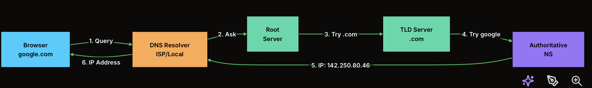

You type "google.com" into your browser, and DNS translates that domain name into an IP address your computer can actually route to.
=> Without DNS, you would need to memorize the IP address of every website you visit.

The resolution process happens step by step:

1. Your browser first checks its local DNS cache.
2. If the answer is not there, it asks a DNS resolver, usually provided by your ISP (Internet Service Provider. -> Viettel, Vinaphone).
3. The resolver asks a root DNS server where to find the right top-level domain server (TLD: .com, .org).
4. The root server points the resolver to the correct top-level domain server, such as `.com` or `.org`.
5. The top-level domain server points the resolver to the authoritative name server for that specific domain.
6. The authoritative name server returns the actual IP address for the domain.
7. The result gets cached by the resolver, the browser, and other layers so the full chain does not repeat for every request.

Browser
-> DNS Resolver
-> Root Server
-> .com TLD Server
-> Authoritative Name Server
-> IP address

DNS is also used for load balancing by returning different IP addresses for the same domain.
=> It can also support failover by pointing traffic to a backup server when the primary server goes down.

Now that the client can find the server, your request does not always go directly to the server.

4. Proxy vs Reverse Proxy
A proxy is a middleman that sits between clients and servers. But there are two types, and they serve very different purposes.

A forward proxy sits in front of clients => It hides the client's identity from the server.
Think of a VPN or corporate proxy: the server sees the proxy's IP, not yours. Use cases include privacy, content filtering, and bypassing geo-restrictions.

A reverse proxy sits in front of servers. It hides the server's identity from the client. (Nginx and HAProxy)
=> The client thinks it is talking to one server, but the reverse proxy could be routing requests to dozens of backend servers.

=> Handle SSL termination, caching, compression, and load balancing.

Luồng sẽ như này:
Client
-> Forward Proxy
-> Reverse Proxy
-> Backend Server
Server thấy ai?

Backend server thường thấy request đến từ: Reverse Proxy IP
Nó không thấy trực tiếp IP thật của client, trừ khi reverse proxy forward thông tin đó qua header như:

X-Forwarded-For
Forwarded
X-Real-IP

Client thấy ai?

Client thường chỉ thấy domain/IP public của:
Reverse Proxy / Load Balancer

Whenever a client communicates with a server, there’s always some delay. One of the biggest causes of this delay is physical distance and that brings us to our next topic: latency.

5. Latency
Latency is the time it takes for data to travel from point A to point B.

network distance (speed of light in fiber), 
serialization (converting data to bytes), 
processing time on the server, 
and queuing delays when the server is busy. 
You cannot beat physics, so a request from Mumbai to New York will always take longer than Mumbai to a nearby server.

This is why system design solutions often include
+ CDNs (serving content from nearby edge nodes)
+ caching (avoiding round trips to the database)
+ regional deployments (placing servers closer to users)

Reducing latency is one of the most common non-functional requirements in system design.

6. HTTP / HTTPS
HTTP (Hypertext Transfer Protocol) is the language that clients and servers use to communicate on the web
=> It defines how requests are structured and how responses come back.

HTTPS is the same thing, but encrypted with TLS so nobody can eavesdrop.

HTTP is stateless: each request is independent, and the server does not remember previous requests.
This makes scaling easier (any server can handle any request) but means you need mechanisms like cookies, tokens, or sessions to maintain state across requests.

Key things to know for interviews: HTTP methods (GET, POST, PUT, DELETE), status codes (200 OK, 404 Not Found, 500 Server Error), and headers (for authentication, caching, content type). HTTPS adds a TLS handshake that takes an extra round trip but protects data in transit.

Authorization: Bearer eyJhbGciOi...
Cookie: session_id=abc123
Cache-Control: max-age=3600

Headers = thông tin phụ đi kèm request/response
Authentication headers = xác thực user/client
Caching headers = kiểm soát cache
Content-Type headers = nói body là JSON, HTML, image, etc.

Group 2: APIs and Communication
7. APIs (Application Programming Interfaces)
An API is a contract between two pieces of software. It defines what you can ask for, how to ask for it, and what you will get back.

Most modern APIs communicate using JSON over HTTP. The client sends a request to a specific URL (called an endpoint), the server processes it, and returns a response with a status code and data.

But, not all APIs are built the same. Different API styles exist to serve different needs. Two of the most popular ones are REST and GraphQL.

8. REST API

It treats everything as a "resource" and uses standard HTTP methods to interact with those resources. It is simple, stateless, and works well for most applications.

REST maps naturally to CRUD operations: Create (POST), Read (GET), Update (PUT/PATCH), and Delete (DELETE).

Key REST principles:
+ stateless (no session on the server)
+ cacheable (responses can be cached)
+ uniform interface (consistent URL patterns)

What if the client could get exactly the data it needs in a single request?

9. GraphQL

GraphQL, developed by Facebook, lets clients request exactly the data they need in one query.

With REST, fetching a user's profile with their posts might require two separate requests: one to /users/123 and another to /users/123/posts. With GraphQL, you describe both in a single query, and the server resolves them and returns a combined result.

The trade-off? GraphQL adds complexity on the server side (you need resolvers for each field), can make caching harder (since every query is different), and can lead to performance issues if clients request deeply nested data.

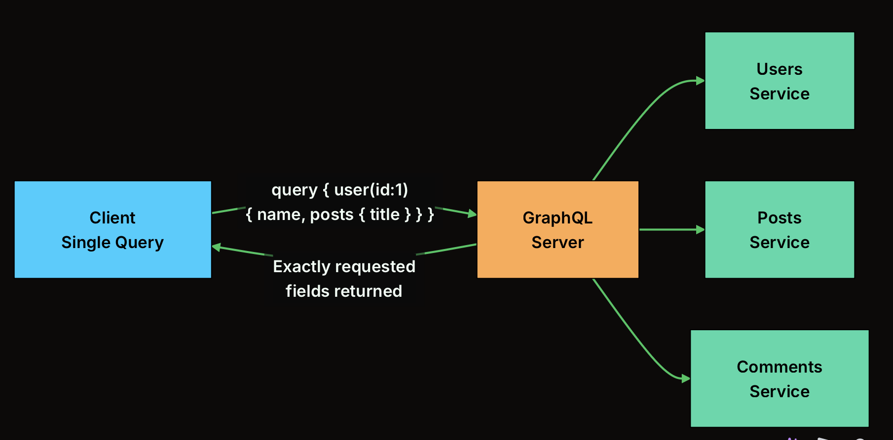

Note;
For most system design problems, REST is the safer default, but mentioning GraphQL shows breadth of knowledge, especially for systems where clients need flexible data fetching (like social media feeds).
REST and GraphQL handle request-response patterns. But what about real-time communication where the server needs to push data to clients?

Proxy thường chuyển tiếp request: Client request A -> proxy -> Server A
GraphQL server hiểu request ở tầng application: GraphQL server không chỉ chuyển tiếp. Nó đọc query, hiểu schema, gọi resolver, gom dữ liệu, transform dữ liệu.

Field user lấy ở đâu?
Field orders lấy ở service nào?
Có cần batch request không?
Có cần check permission field này không?
Response shape trả về ra sao?

10. WebSockets

HTTP is a one-way street: the client always initiates the request. But what about chat apps, live sports scores, or collaborative editors?

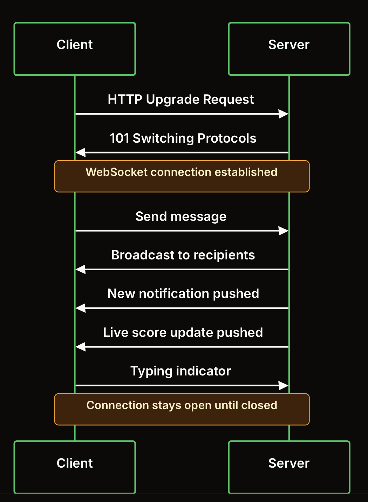

WebSockets start as a regular HTTP request, then "upgrade" to a persistent, bidirectional connection.
=> Once established, both sides can send messages at any time without the overhead of creating new HTTP connections.

Initially: Client -> Server: HTTP request

Request sẽ có header kiểu: (Tôi đang dùng HTTP, nhưng tôi muốn nâng cấp connection này thành WebSocket.)

GET /chat HTTP/1.1
Host: example.com
Upgrade: websocket
Connection: Upgrade
Sec-WebSocket-Key: abc123
Sec-WebSocket-Version: 13

Nếu server đồng ý, server trả:
HTTP/1.1 101 Switching Protocols
Upgrade: websocket
Connection: Upgrade
Sec-WebSocket-Accept: xyz456

The downside is that WebSocket connections are stateful, the server needs to keep track of every open connection, which makes scaling harder. If a server goes down, all its connections are lost.

11. Webhooks
Webhooks flip the usual model around. (Webhook đảo ngược mô hình thông thường.)

Instead of the client repeatedly asking "has anything changed?" (polling)
=> the server sends a notification to the client when something happens
=> The client registers a callback URL, and the server POSTs to that URL whenever the event occurs.

For examples: Webhooks are widely used for integrations: payment notifications (Stripe), code push events (GitHub), message delivery status (Twilio)

=> The key challenge is reliability, what if your server is down when the webhook fires? Good webhook systems include retry logic, event logging, and idempotency handling.

Group 3: Data Storage

12. Databases
A database is an organized collection of data that supports efficient storage, retrieval, and manipulation. But there is no single "best" database. Different data shapes and access patterns call for different types.

13. SQL vs NoSQL
SQL databases enforce a strict schema and support ACID transactions. NoSQL databases trade some of that rigidity for flexibility and horizontal scalability.

Choose SQL when: You need strong consistency (banking, inventory), complex queries with joins, well-defined schemas that rarely change, or ACID guarantees.

Choose NoSQL when: You need horizontal scalability, your schema evolves frequently, you are dealing with high write throughput, or your data is naturally unstructured (logs, social media posts).

The key interview insight is explaining why you chose one over the other for a specific part of your system.
(We use both SQL and noSQL).
Once you have data in a database, how do you find it quickly?

14. Database Indexing

An index is a data structure that makes lookups fast, like the index at the back of a textbook.

Most databases use B-tree indexes by default. A B-tree organizes data in a sorted, balanced tree structure that supports O(log n) lookups. When you create an index on the email column, the database builds a separate B-tree that maps email values to their row locations on disk.

The trade-off: indexes speed up reads but slow down writes (every INSERT or UPDATE must also update the index). They also consume storage space. (disk/storage của database).

15. Vertical Partitioning

Vertical partitioning means splitting a large table by columns.

Instead of storing every field in one wide table, you separate frequently used columns from rarely used or heavy columns.

Example:

users table:

id, name, email, password_hash, bio, avatar_url, preferences, created_at

Can be split into:

users:
id, name, email, password_hash, created_at

user_profiles:
user_id, bio, avatar_url

user_preferences:
user_id, preferences

=> The key idea: same entity, same user, but different columns live in different tables.

This helps when a table becomes too wide or some columns are large but not always needed.
For example, login only needs email and password_hash. It does not need bio, avatar_url, or preferences.

The benefit:
+ faster common queries
+ less disk I/O because the database reads fewer columns
+ better separation between hot data and cold data
+ sensitive or rarely used data can be isolated

The trade-off:
+ reading the full object may require joins
+ writes may touch multiple tables
+ more schema and query complexity

Important distinction:

Horizontal partitioning splits rows.
=> user_id 1-1000 on one shard, user_id 1001-2000 on another shard.

Vertical partitioning splits columns.
=> basic user data in one table, profile/settings data in another table.

16. Caching

Caching stores frequently accessed data in a fast layer (usually memory) so you do not have to hit the database for every request. It is the single most effective technique for improving read performance.

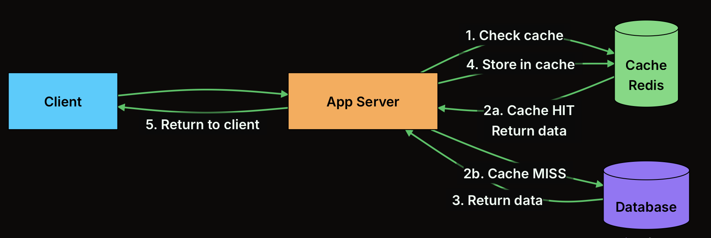

The pattern shown above is called cache-aside (or lazy loading). 
The application checks the cache first. On a hit, it returns immediately. On a miss, it fetches from the database, stores the result in the cache, and then returns it.

The hard part of caching is invalidation: when the underlying data changes, the cache needs to be updated or cleared.  Common strategies include 
TTL (time-to-live, data expires automatically), 
write-through (update cache and database together), and 
write-behind (update cache first, database later).

17. Denormalization

In normalized databases, data is split across many tables to avoid duplication. That is clean, but joining 5 tables to load a single page is slow. Denormalization deliberately adds redundant data to reduce the number of joins.

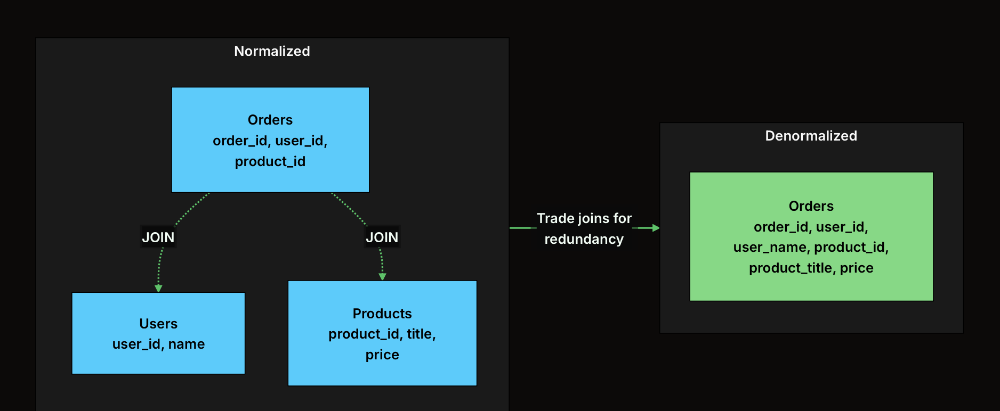

+ In the normalized version, displaying an order with the user's name and product title requires joining three tables.

+ In the denormalized version, all the data is in one table, so a single read returns everything. The trade-off: you are storing user_name and product_title in the orders table, which means if a user changes their name, you need to update it in multiple places.

=> Denormalization is a read optimization. Use it when your system is read-heavy and those reads involve expensive joins. It is very common in NoSQL databases, where joins are not natively supported. 

=> In interviews, always pair denormalization with a strategy for keeping the redundant data consistent.

18. Blob Storage

Not all data fits neatly into rows and columns. 
=> Images, videos, PDFs, backups, these are "binary large objects" (blobs) that need specialized storage

Binary = dữ liệu dạng nhị phân
Large = thường có kích thước lớn
Object = một khối dữ liệu được lưu như một object/value

=> Blob storage systems like Amazon S3 are designed to store massive amounts of unstructured data cheaply and reliably.

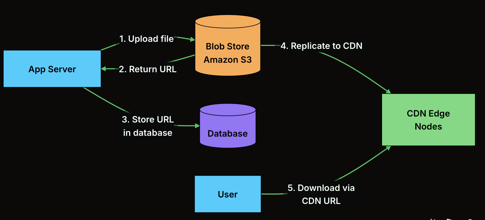

App Server uploads image/video/PDF
-> Blob Store / S3 stores original file
-> CDN copies or caches that file near users
-> User downloads from nearby CDN node

Original file:
S3 in Singapore

User:
Vietnam

CDN edge:
Ho Chi Minh City / nearby region

Instead of the user downloading directly from S3 every time, the user downloads from the nearby CDN edge node.

Small nuance: replicate here may not always mean the file is immediately copied to every CDN server. Often CDN works lazily:

First user requests file
-> CDN checks if it has the file
-> If not, CDN fetches from S3
-> CDN stores/caches it
-> Next users get it from CDN

Make the blob available/cached on CDN edge nodes so users download from CDN, not directly from blob storage.

Group 4: Scaling
A single server can not handle the load anymore. => Scaling is about handling more traffic, more data, and more users without things falling apart

=> There are two fundamental approaches, and they are not mutually exclusive.

19. Vertical Scaling (Scale Up)
The simplest way to handle more load: get a bigger machine. More CPU, more RAM, faster disks. That is vertical scaling. No code changes required.

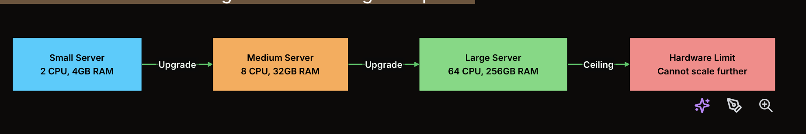

Vertical scaling is attractive because it is simple. Your application does not need to worry about distributing work across multiple machines

=> The problem? There is a hard ceiling. You can not keep buying bigger machines forever. The largest cloud instances have limits, and they get disproportionately expensive. 

=> You also have a single point of failure: if that one big server goes down, everything goes down. That is why, beyond a certain point, you need a different approach.

20. Horizontal Scaling (Scale Out)

Instead of making one server bigger, add more servers. Horizontal scaling distributes the load across multiple machines, and there is no theoretical upper limit to how many you can add.

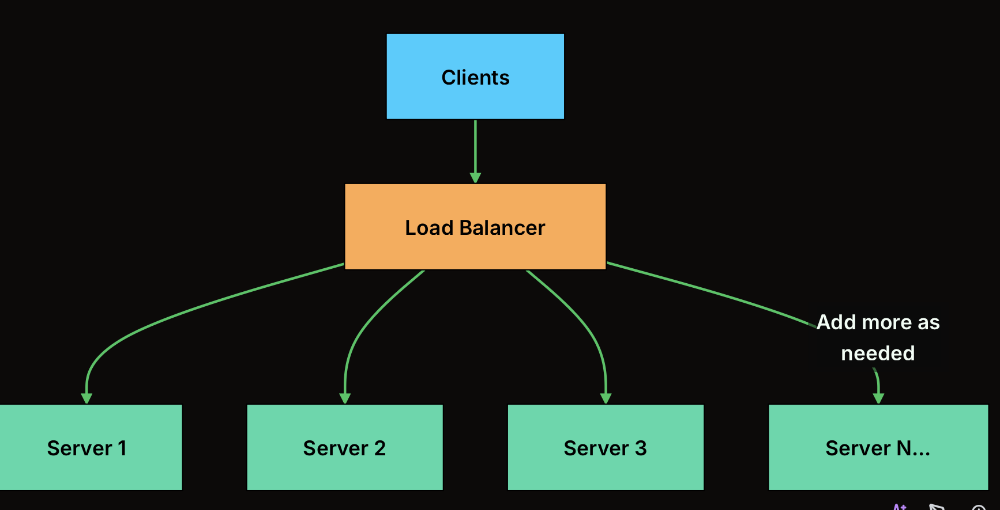

The catch? Your application needs to be designed for it. Servers should be stateless, meaning any server can handle any request without relying on local state.
=> Session data needs to live in a shared store (like Redis), not in server memory.
=> You also need a load balancer to distribute traffic, and your database needs its own scaling strategy (replication, sharding).

But how do you decide which server handles each request? That is where load balancers come in.

21. Load Balancers
A load balancer sits between clients and your server pool, distributing incoming requests so no single server gets overwhelmed. It is the traffic cop of your system.

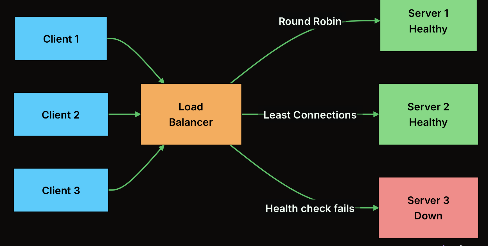

Common algorithms include 
+ Round Robin (requests go to servers in order), 
+ Least Connections (send to the server handling the fewest requests), and 
+ Weighted (servers with more capacity get more traffic). 
The load balancer also runs health checks: if a server stops responding, traffic is automatically routed to healthy servers.

Load balancers provide two critical benefits: 
+ scalability (distribute load across many servers) and 
+ availability (route around failures)

In system design, you will always place a load balancer in front of your application servers.
Some systems use multiple layers: one LB for web servers, another for application servers, another for databases.

Browser -> Nginx -> Spring Boot -> PostgreSQL
Browser = client
Nginx = web server / reverse proxy
Spring Boot = application server
PostgreSQL = database

DB server thường nói về machine/process/server chạy database.
=> 
PostgreSQL server
MySQL server
MongoDB server

=> 
physical machine
VM
container
managed database node

DB instance thường nói về một bản chạy cụ thể của database engine.

PostgreSQL instance
MySQL instance
RDS instance

Nó là một đơn vị database đang chạy, có config, memory, storage, connections, databases bên trong.

Trong thực tế system design, nhiều khi người ta dùng gần như thay thế nhau: DB server = DB instance

22. Replication

Replication copies your data across multiple database servers. The most common setup is primary-replica: 
=> all writes go to the primary, and changes are replicated to one or more replicas that handle read queries.

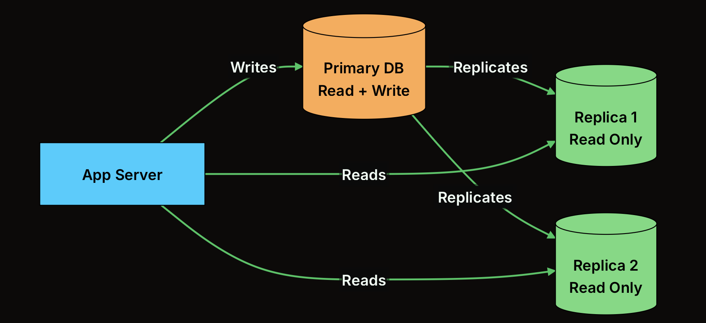

Most applications are read-heavy (think of how many times you scroll Twitter/X vs how many times you tweet).

=> By directing reads to replicas, you offload the primary database and can handle many times more read traffic

=> If a replica fails, reads are redirected to other replicas. If the primary fails, a replica can be promoted to take over

The trade-off is replication lag: there is a small delay between when data is written to the primary and when it appears on replicas.

Replication handles read scaling. But what about write scaling, when a single primary cannot keep up with write volume?

23. Sharding

Sharding splits your data across multiple database nodes, where each node holds a different subset of the data

=> Unlike replication (every node has all the data), sharding means each node has only a portion. This distributes both storage and write load.

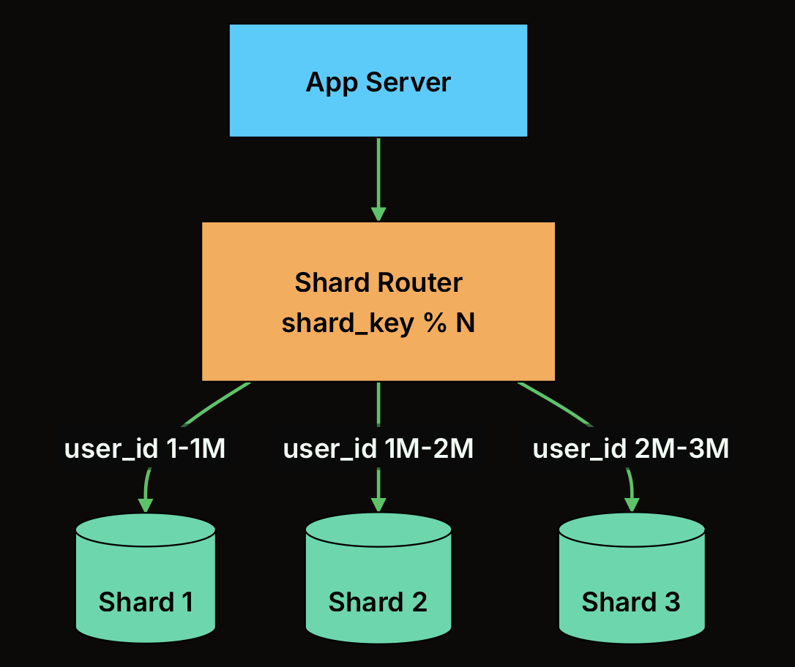

The shard key determines which shard holds each piece of data. A common approach is hash-based sharding.
=> compute a hash of the key (like user_id) and use modulo to pick a shard.

Sharding challenges include: cross-shard queries (joining data across shards is expensive), rebalancing (adding a new shard means redistributing data), and operational complexity.

Group 5: Distributed Systems

Once you have multiple servers, databases, and caches spread across a network, you enter the world of distributed systems. Some challenges will arise:
+ Keeping data consistent => hard when machines can fail independently and network can partition

24. CAP Theorem

The CAP theorem states that a distributed system can only guarantee two out of three properties: 

Consistency (every read returns the latest write), 
Availability (every request gets a response), and 
Partition Tolerance (the system works even if network links between nodes fail).

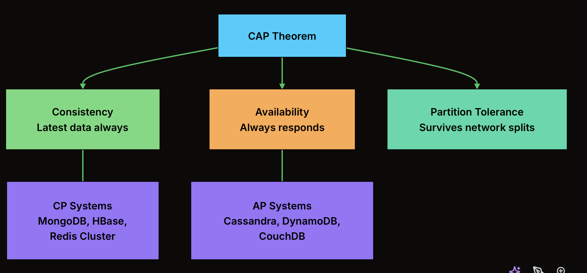

Since network partitions are unavoidable in distributed systems, the real choice is between CP (consistency + partition tolerance) and AP (availability + partition tolerance).

Data consistency is one challenge of distributed systems. Another is delivering content fast to users around the world.

25. CDN (Content Delivery Network)

A CDN is a network of servers distributed across the globe that caches and serves content from locations close to users. 

=> Instead of every request traveling to your origin server in Virginia, users get content from the nearest edge node.

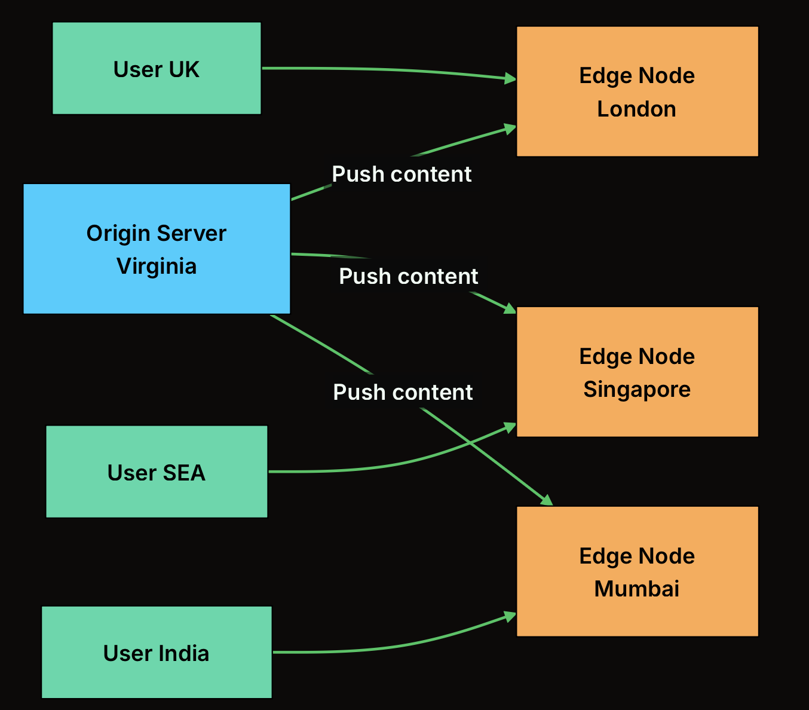

CDNs primarily serve static content: images, CSS, JavaScript, videos. Some CDNs (like CloudFlare) also cache dynamic content or run serverless functions at the edge. 
=> The first user in a region gets a cache miss (request goes to origin), but subsequent users in that region get the cached copy, which is orders of magnitude faster.

=> In system design interviews, always include a CDN when your system serves media or static assets.
=> It reduces latency, decreases load on your origin server, and improves availability (even if your origin goes down, cached content can still be served).

CDNs handle content delivery. But what about ensuring that retried requests do not cause duplicate side effects?

26. Idempotency

An idempotent operation produces the same result regardless of how many times you execute it.

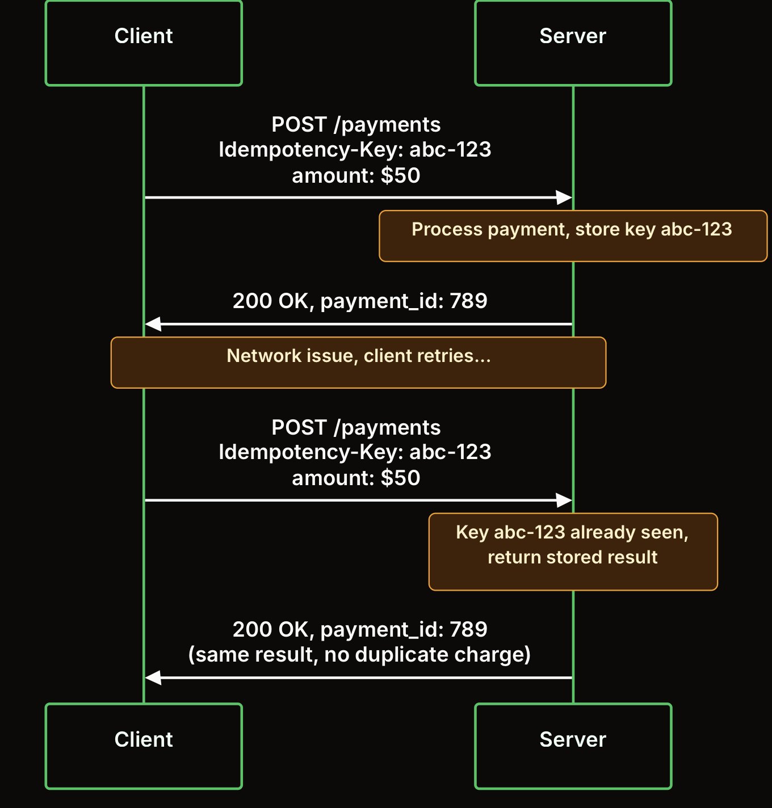

GET and DELETE are naturally idempotent (getting a resource twice returns the same thing, deleting an already-deleted resource is a no-op).

POST is not naturally idempotent, which is why you add an idempotency key: a unique identifier the client sends with each request.

=> The server checks if it has already processed that key and returns the cached result instead of processing again.

Group 6: Architecture Patterns

27. Microservices

As applications grow, a single codebase (monolith) becomes hard to maintain, deploy, and scale. 
=> Microservices split the application into small, independent services, each responsible for one business capability, each with its own database.

Pros:
Each microservice can be developed, deployed, and scaled independently.

Cons:
The downsides are real: 
+ distributed systems complexity (network calls instead of function calls), 
+ data consistency across services (no shared database means no easy joins), and 
+ operational overhead (monitoring, deploying, and debugging dozens of services).

28. Message Queues
Synchronous communication (service A calls service B and waits for a response) creates tight coupling.
=> If service B is slow or down, service A suffers too.
=> Message queues decouple services by introducing an intermediary that stores messages until the consumer is ready to process them.

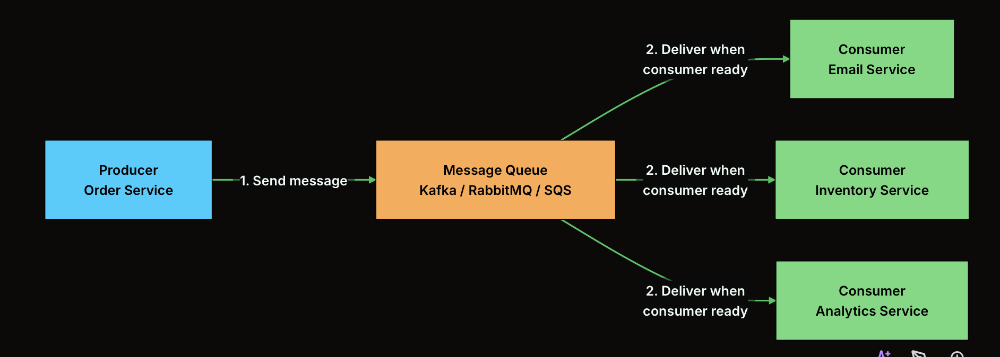

Message queues provide: 
+ decoupling (services do not need to know about each other), 
+ buffering (handle traffic spikes by absorbing bursts), 
+ reliability (messages persist even if consumers crash), and 
+ scalability (add more consumers to process faster). 
Popular choices include Kafka (high throughput, event streaming), RabbitMQ (traditional message broker), and SQS (managed AWS service).

Popular choices include 
Kafka (high throughput, event streaming), 
RabbitMQ (traditional message broker), and 
SQS (managed AWS service).

Services are decoupled now, but every external client still needs to know the address of every service. How do you simplify that?

29. Rate Limiting

When your API is public, or even when it is internal, you need to protect it from being overwhelmed. 
Rate limiting controls how many requests a client can make within a time window. 
=> It prevents abuse, protects backend services, and ensures fair usage.

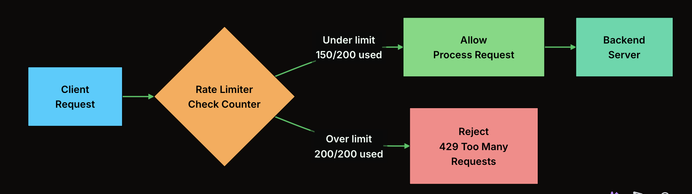

Common algorithms include 
+ Token Bucket (tokens refill at a fixed rate; each request costs a token), 
+ Sliding Window (count requests in a rolling time window), and 
+ Fixed Window (count requests in discrete time intervals). 
The rate limiter typically sits at the API gateway level and uses a fast store like Redis to track request counts per client.

Rate limiting is essential for: 
+ preventing DDoS attacks, 
+ protecting expensive operations (like database queries), 
+ enforcing API usage tiers (free users get 100 req/min, paid users get 10,000)

30. API Gateway
An API gateway is a single entry point for all client requests. Instead of clients talking directly to dozens of microservices, they talk to the gateway, which handles routing, authentication, rate limiting, and other cross-cutting concerns.

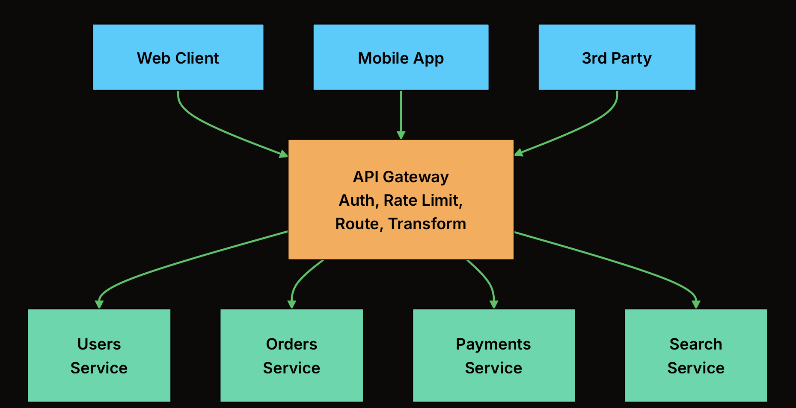

Without an API gateway, every service would need to implement authentication, rate limiting, and logging independently.
=> The gateway centralizes these concerns
=> It also simplifies the client: instead of knowing the addresses of 20 services, the client knows one URL. =. => The gateway routes each request to the right service based on the path.

Additional gateway capabilities include:

+ request/response transformation: converting between protocols or data formats.
  Example: external clients send JSON over HTTP, but the gateway calls an internal gRPC service and converts the result back to JSON.

+ response aggregation: combining results from multiple services into one response.
  Example: `GET /home` calls User Service, Feed Service, and Notification Service, then returns one combined home page response to the client.

+ caching: storing frequent responses at the gateway so repeated requests do not hit backend services every time.
  Example: cache `GET /products/top` for 60 seconds because many users request the same list.

+ circuit breaking: stopping requests to a failing service temporarily so failure does not spread through the whole system.
  Example: if Payment Service keeps timing out, the gateway stops sending traffic to it for a short time and returns a fallback/error response quickly.

Popular options include Kong, AWS API Gateway, and Nginx.

Q&A: Why do we need rate limit?

We need rate limiting because unbounded request volume can overwhelm the system faster than it can process work.

If too many requests enter the system at the same time:

+ CPU usage increases because every request needs parsing, authentication, business logic, JSON serialization, and sometimes TLS work.
+ Memory usage increases because in-flight requests hold request objects, response buffers, user context, and temporary data.
+ Connection pools get exhausted because app servers and databases have a limited number of open connections.
+ Database load increases because one API request may trigger multiple queries.
+ Queue length increases when incoming requests are faster than processing capacity.
+ Latency increases because requests wait longer in queues.
+ Timeouts increase because clients do not get responses quickly enough.
+ Retries increase because clients retry timed-out requests, which creates even more traffic.

That can become a retry storm:

server is slow
-> clients retry
-> more requests arrive
-> server becomes even slower
-> more timeouts happen

Rate limiting protects the system by rejecting or delaying excess requests before they go deep into expensive backend paths.
The common response is:

429 Too Many Requests

Example:

Free user: 100 requests/minute
Paid user: 10,000 requests/minute
One IP address: 1,000 requests/minute

=> Rate limiting keeps traffic within the capacity that the system can safely handle.
