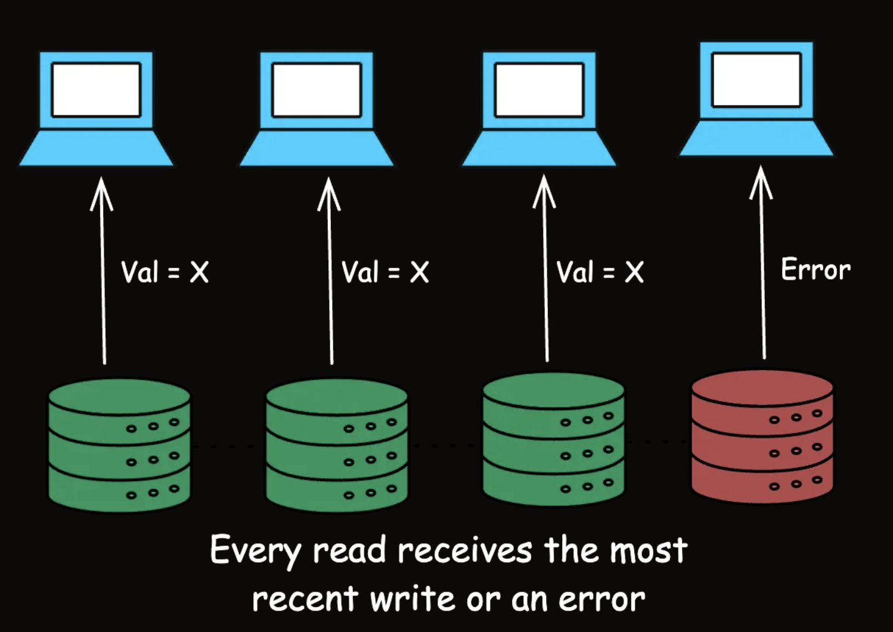
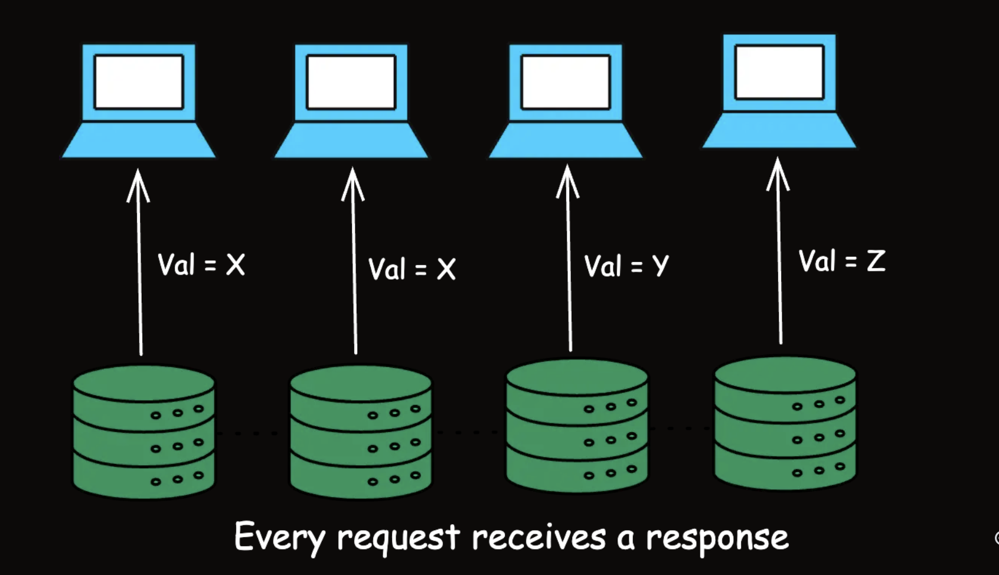
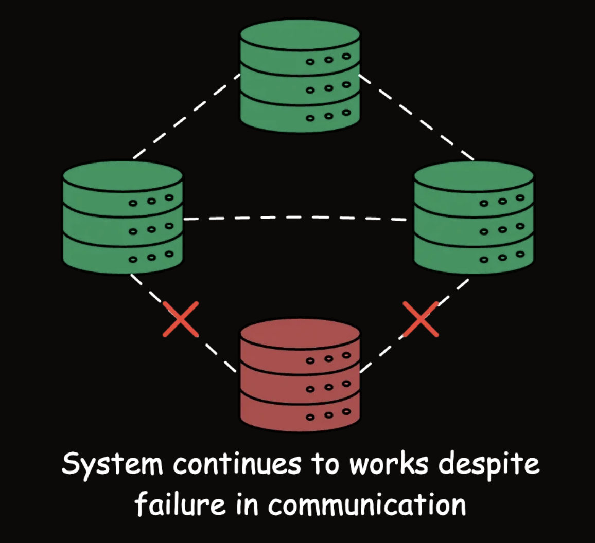

1. Introduction
CAP stands for Consistency, Availability, and Partition Tolerance, and the theorem states that:

Consistency (C): Every read receives the most recent write or an error.

Availability (A): Every request (read or write) receives a non-error response, without guarantee that it contains the most recent write.

Partition Tolerance (P): The system continues to operate despite an arbitrary number of messages being dropped (or delayed) by the network between nodes.

2. Consistency

Consistency ensures that every read receives the most recent write or an error. This means that all working nodes in a distributed system will return the same data at any given time.

`Trong CAP theorem, Consistency là đảm bảo tất cả node nhìn thấy cùng một version dữ liệu. Sau khi một write thành công, bất kỳ read nào cũng phải thấy dữ liệu mới nhất hoặc hệ thống phải từ chối request thay vì trả dữ liệu cũ.`

3. Availability

Availability guarantees that every request (read or write) receives a response, without ensuring that it contains the most recent write.

4. Partition Tolerance
Partition Tolerance means that the system continues to function despite network partitions where nodes cannot communicate with each other.

A network partition occurs when a network failure causes a distributed system to split into two or more groups of nodes that cannot communicate with each other.

5. The CAP Trade-Off: Choosing 2 out of 3

The CAP theorem asserts that in the presence of a network partition, a distributed system must choose between Consistency and Availability.

A. CP (Consistency and Partition Tolerance)

These systems prioritize consistency and can tolerate network partitions, but at the cost of availability. 

=> During a partition, the system may reject some requests to maintain consistency

`Banking systems typically prioritize consistency over availability since data accuracy is more critical than availability during network issues. Consider an ATM network for a bank. When you withdraw money, the system must ensure that your balance is updated accurately across all nodes (consistency) to prevent overdrafts or other errors.`

B. AP (Availability and Partition Tolerance)

These systems ensure availability and can tolerate network partitions, but at the cost of consistency. => During a partition, different nodes may return different values for the same data.

`Amazon's shopping cart system is designed to always accept items, prioritizing availability. When you add items to your Amazon cart, the action almost never fails, even during high traffic periods like Black Friday.`

6. Practical Design Strategies

A. Eventual Consistency: For many systems, strict consistency isn't always necessary.
=> Eventual consistency can provide a good balance where updates are propagated to all nodes eventually, but not immediately.

`Example: Systems where immediate consistency is not critical, such as DNS and content delivery networks (CDNs).`

B. Strong Consistency
=> A model ensuring that once a write is confirmed, any subsequent reads will return that value.

Example: Systems requiring high data accuracy, like financial applications and inventory management.

C. Tunable Consistency

=> Tunable consistency allows systems to adjust their consistency levels based on specific needs, providing a balance between strong and eventual consistency.

Systems like Cassandra allow configuring the level of consistency on a per-query basis, providing flexibility.

`Example: Applications needing different consistency levels for different operations, such as e-commerce platforms where order processing requires strong consistency but product recommendations can tolerate eventual consistency.`

7. Quorum-Based Approaches:
=> use voting among a group of nodes to ensure a certain level of consistency and fault tolerance.

`Example: Systems needing a balance between consistency and availability, often used in consensus algorithms like Paxos and Raft.`

8. Beyond CAP: PACELC

If there is a partition (P), the trade-off is between availability and consistency (A and C).
Else (E), the trade-off is between latency (L) and consistency (C).