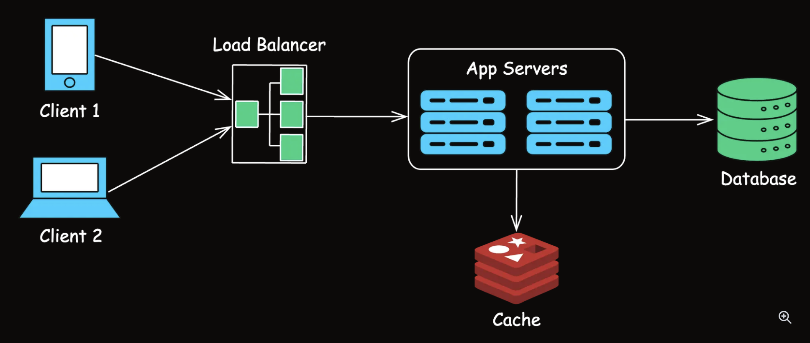

1. Understanding SPOFs

A Single Point of Failure (SPOF) is any component within a system whose failure would cause the entire system to stop functioning.

In distributed systems, failures are inevitable. Common causes include hardware malfunctions, software bugs, power outages, network disruptions, and human error.

=> While failures can't be entirely avoided, the goal is to ensure they don’t bring down the entire system.

=> In system design, SPOFs can include a single server, network link, database, or any component that lacks redundancy or backup.

This system has 
+ one load balancer, 
+ two application servers, 
+ one database, and 
+ one cache server.

Clients 
+ send requests to the load balancer, which 
+ distributes traffic across the two application servers. 
+ The application servers retrieve data from the cache if it's available, or from the database if it's not.

In this design, the potential SPOFs are:

Load Balancer: if it fails, all traffic will stop. To avoid this, we can add a standby load balancer that can takeover if the primary one fails.

Database: With only one database, its failure would result in data being unavailable, causing downtime and potential data loss. We can avoid this by replicating the data across multiple servers and locations.

Cache Server: The cache server is not a true SPOF in the sense that it doesn’t bring the entire system down. When it’s down, every request hits the database, increasing its load and slowing response times.

2. Strategies to Avoid Single Points of Failures

1. Redundancy
2. Load Balancing: To prevent the single load balancer becoming a single point of failure, we can add a standby load balancer which can take over if the primary one fails. (Primary and Secondary)
3. Data Replication: Synchronous Replication and Asynchronous Replication
4. Geographic Distribution
+ Content Delivery Networks (CDNs) to distribute content globally, improving availability and reducing latency.
+ Multi-Region Cloud Deployments to ensure that an outage in one region does not disrupt your entire application.

5. Graceful Handling of Failures

Example: If a service that provides user recommendations fails, the application should still function, perhaps with a message indicating limited features temporarily.

Implement failover mechanisms to automatically switch to backup systems when failures are detected.

Yes, for stateless servers and service instances, failover is commonly configured through Kubernetes and cloud load balancers. But for databases, queues, stateful services, and business workflows, you still need application-level failover, retries, idempotency, and data consistency design.

6. Monitoring and Alerting: Health Checks, Automated Alerts, Self-Healing Systems