1. What is availability?
Availability measures how often your system is operational and accessible to users. A highly available system continues functioning even when individual components fail.

A system can be highly available (always up) but unreliable (sometimes gives wrong answers).

2. Measuring availability
Overall = 99.9% × 99.9% × 99.9% = 99.7%

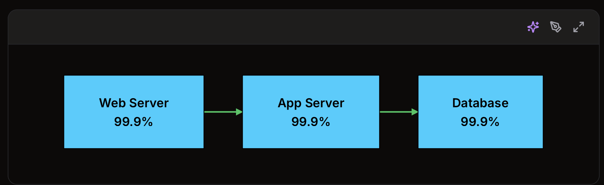

- Common Failure Modes

To design for availability, you must understand how things fail. Failures do not ask permission, and they rarely happen at convenient times. Knowing the common failure modes helps you prepare for them.

2.1: Hardware Failures

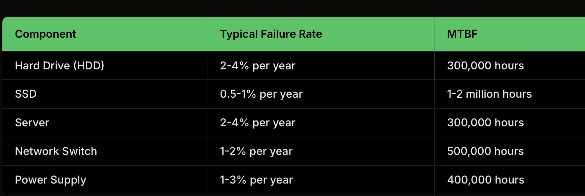

2.2: Software Failures: Hardware breaks randomly. Software breaks creatively.

+ Bugs: Code defects that cause crashes or incorrect behavior
+ Memory leaks: Gradual resource exhaustion
+ Deadlocks: Processes waiting on each other indefinitely
+ Cascading failures: One failure triggering failures in dependent systems

2.3: Network Failures: Networks fail in ways that are subtle, intermittent, and painful to debug.

+ Packet loss: Data does not reach its destination
+ Latency spikes: Delays in communication
+ Partition: Network split isolates groups of servers
+ DNS failures: Name resolution stops working

2.4: Human Errors

Common examples:

+ Configuration mistakes: wrong environment variable, typo in a config file
+ Failed deployments: bad code or broken migrations pushed to production
+ Accidental deletions: running the wrong command in the wrong place
+ Capacity planning errors: underestimating traffic for a launch

3. Redundancy: The Foundation of Availability

A. Active-Passive (Standby)

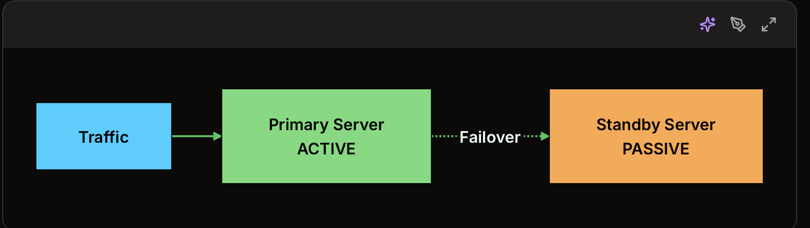

Pros: 
Simple to reason about, Standby typically uses fewer resources, Clear source of truth

Cons:

+ Failover takes time (detection + promotion + routing changes)
+ Standby may not be truly “production-ready” because it isn’t tested under real load
+ Potential for split-brain problem

DB A = primary
DB B = standby

=> Nhưng nếu network giữa A và B bị đứt, mỗi bên có thể nghĩ bên kia đã chết:
=> Sau khi network hồi phục, hệ thống không biết bản nào đúng. Vì vậy split-brain rất nguy hiểm trong database, leader election, distributed lock, HA systems.

Standby Type	State	Failover Time	Cost
Cold Standby	Powered off, needs to boot	Minutes	Lowest
Warm Standby	Running but not receiving traffic	Seconds to minutes	Medium
Hot Standby	Running, data synchronized, ready to serve	Seconds	Highest

B. Active-Active: In an active-active configuration, all components handle traffic simultaneously. There is no distinction between primary and backup because every node is doing real work.

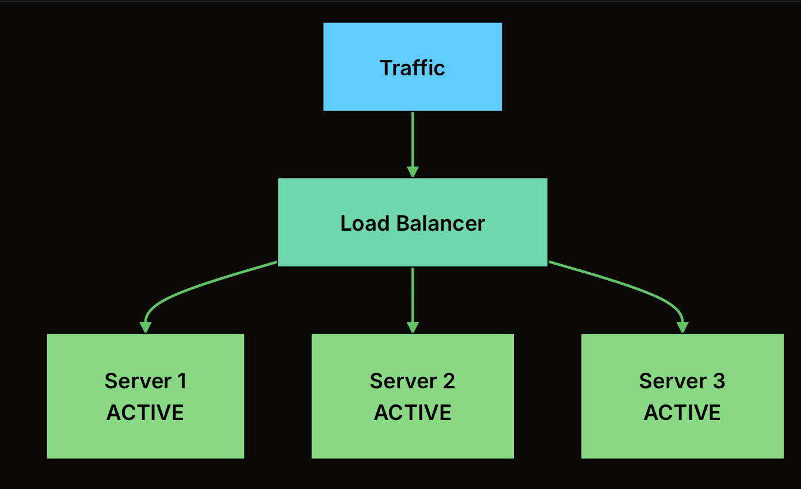

Pros: No failover delay, All nodes tested under real load, Better resource utilization
Cons: More complex, Must handle data consistency across nodes, requires stateless design or shared state

C. Geographic Redundancy
Redundancy within a single data center protects against hardware failures, but what if the entire data center goes offline? Power outages, network cuts, natural disasters, or even a backhoe cutting a fiber line can take down an entire facility.

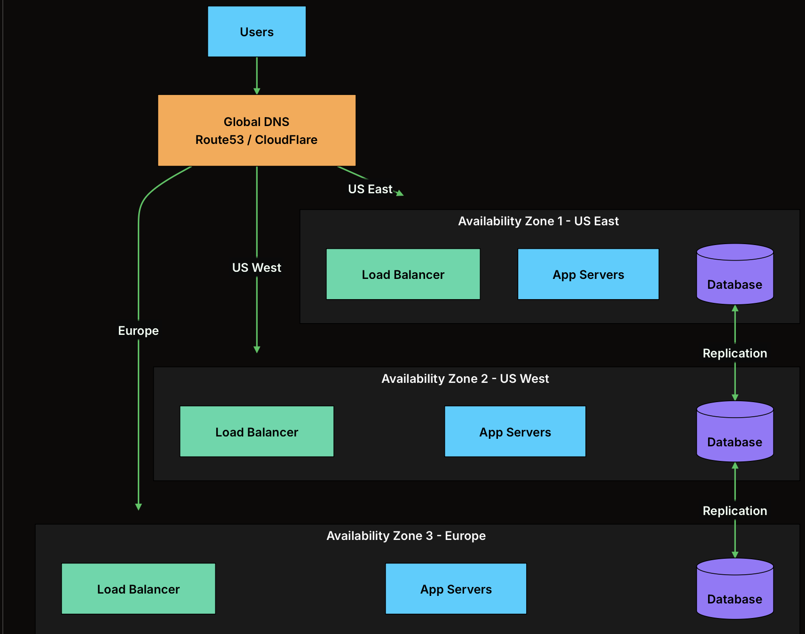

Cloud providers offer different levels of geographic redundancy:

Level	What It Is	Protects Against	Latency Impact
Availability Zones (AZs)	Separate data centers in the same region, connected by low-latency links	Single data center failure	Minimal (1-2ms)
Regions	Geographically separate areas (e.g., US-East vs US-West)	Regional disasters, widespread outages	Significant (50-100ms+)
Multi-Cloud	Different cloud providers (AWS + GCP)	Cloud provider outages	Variable

D. Across layer

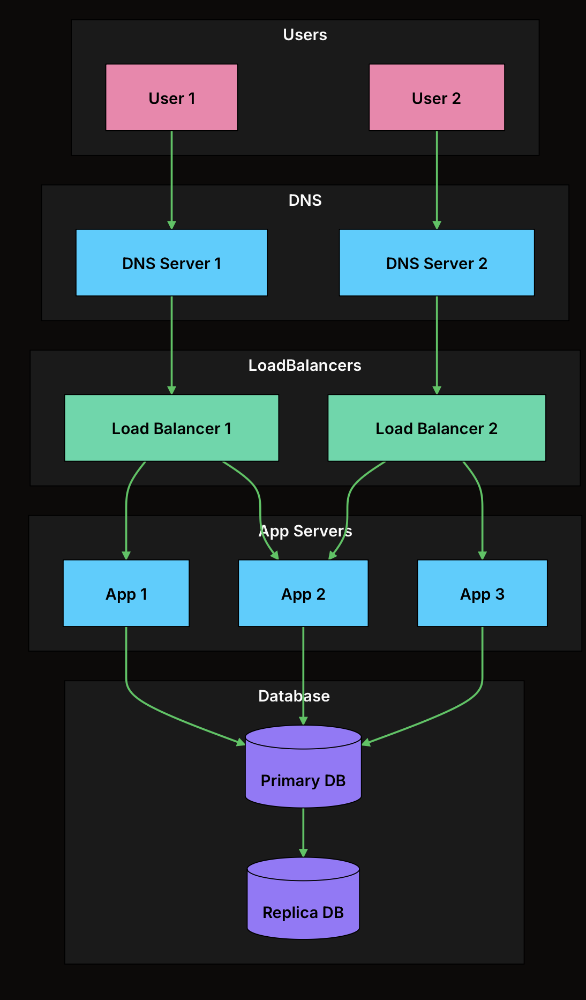

4. High Availability Patterns

Pattern 1: Load Balancer with Multiple Backends

How it provides high availability:
+ Load balancer continuously monitors backend health
+ Failed servers are automatically removed from rotation
+ Traffic redistributes to healthy servers within seconds
+ New servers can be added without any downtime

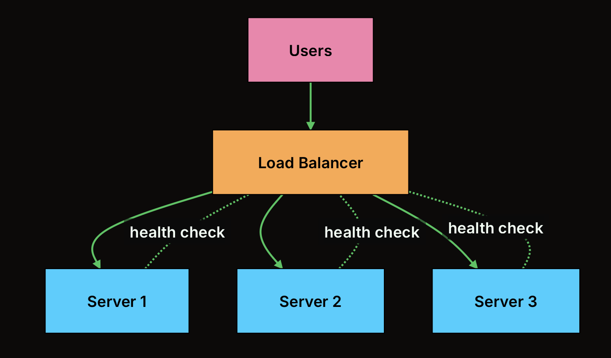

LB is also a SPOF

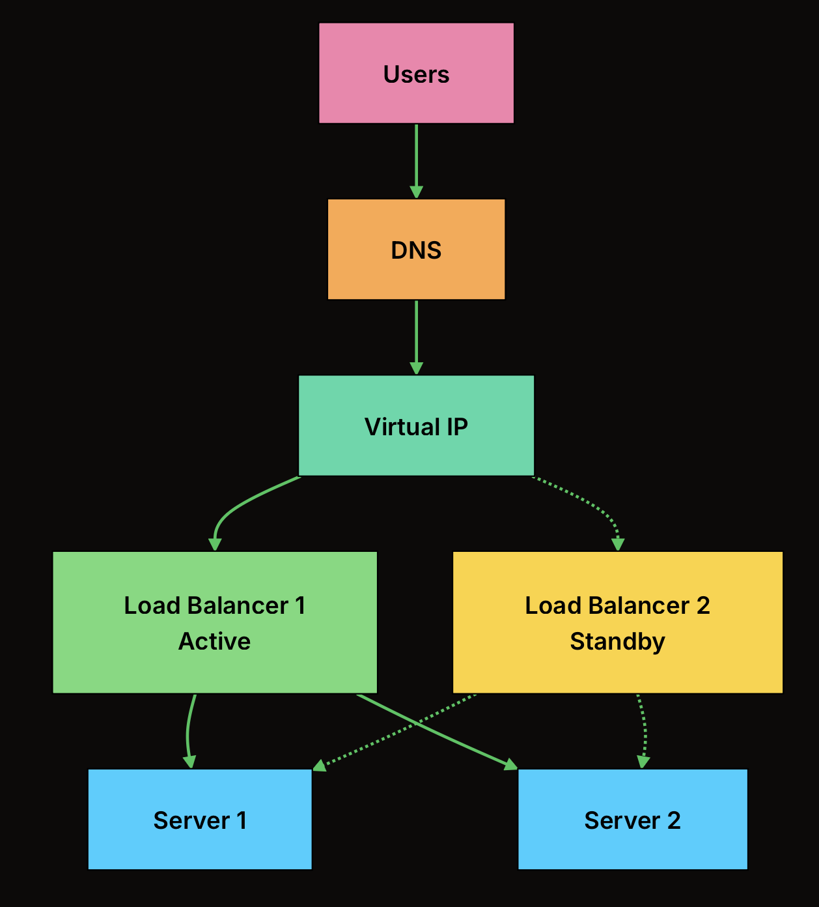

Cloud providers handle this automatically. AWS ALB, Google Cloud Load Balancer, and Azure Load Balancer are all managed services with built-in redundancy

On-premises, you might use keepalived with a virtual IP that floats between two HAProxy instances.

=> Nếu chạy hệ thống trong data center tự quản, bạn có thể dùng keepalived để quản lý một địa chỉ IP ảo. IP này có thể chuyển qua lại giữa hai HAProxy instances. (HAProxy = load balancer. Nó nhận traffic rồi chuyển tới backend servers.)

Pattern 2: Database Replication with Automatic Failover

Databases are stateful and cannot simply be load-balanced like web servers. Database high availability requires replication and careful failover management.

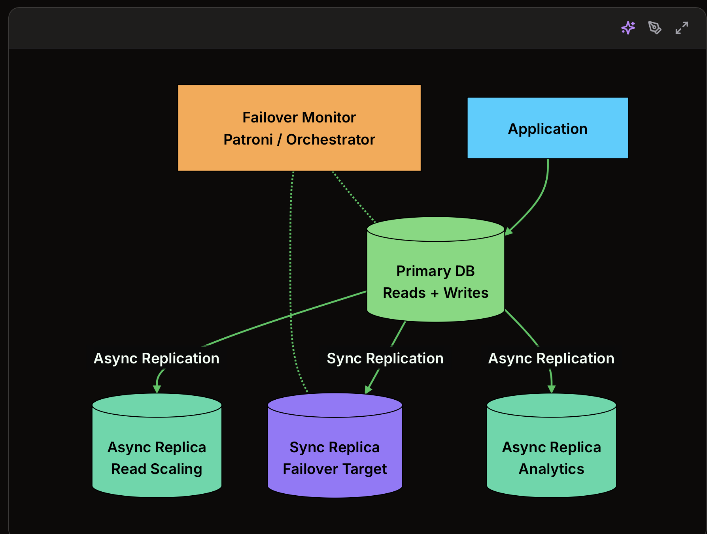

Type	How It Works	Data Loss	Performance Impact
Synchronous	Write confirmed only after replica acknowledges	Zero (RPO = 0)	Higher latency (wait for replica)
Asynchronous	Write confirmed immediately, replica catches up later	Possible (seconds to minutes)	No impact on write latency
Semi-synchronous	Wait for at least one replica, others async	Minimal	Moderate impact

Pattern 3: Queue-Based Load Leveling

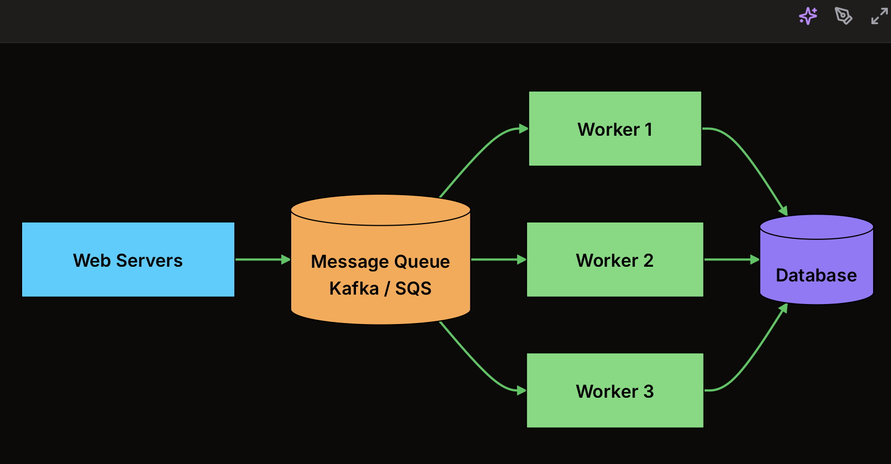

How it provides high availability:
+ Decouples producers from consumers
+ Buffers traffic spikes that would overwhelm the database
+ Workers can fail and restart without losing messages
+ Can scale workers independently based on queue depth

Nếu worker đã lấy request/message từ queue rồi, đang xử lý, nhưng bị out of memory và crash, thì chuyện gì xảy ra phụ thuộc vào acknowledgement mechanism của queue.

Queue -> Worker nhận message -> Worker xử lý -> Worker ack -> Queue xóa message

Worker nhận message
Worker đang xử lý
Worker out of memory, crash
Không gửi ack

Queue thường sẽ coi message đó là chưa xử lý xong, rồi đưa lại vào queue sau một khoảng thời gian.

Tùy hệ thống, cơ chế này có tên như:

visibility timeout trong AWS SQS
ack / nack trong RabbitMQ
consumer offset commit trong Kafka
redelivery trong nhiều message brokers

Ví dụ nguy hiểm:
Worker charge tiền user
Worker crash trước khi ack
Message được xử lý lại
Worker charge tiền user lần nữa

Vì vậy cần thiết kế:

idempotency key
deduplication
transaction/outbox pattern
retry limit
dead-letter queue
monitoring memory usage

Queue/Broker              Worker
    |                       |
    | ---- message -------> |
    |                       | xử lý request
    | <------ ACK --------- |
    |                       |
xóa message / mark done

Cụ thể trong từng hệ thống:

RabbitMQ: worker gửi basic_ack về broker.
AWS SQS: worker gọi API DeleteMessage; đây chính là cách “ack”.
Kafka: consumer commit offset; nghĩa là “tôi đã xử lý tới vị trí này rồi”.
NATS / JetStream: consumer gửi Ack() cho message.
Nên “Không gửi ack” nghĩa là:

Worker nhận message
Worker xử lý chưa xong
Worker crash / out of memory
Worker không kịp gửi tín hiệu xác nhận về queue

Pattern 4: Circuit Breaker
When a dependency fails, continuing to call it wastes resources and can cause cascading failures. The circuit breaker pattern prevents this by failing fast.

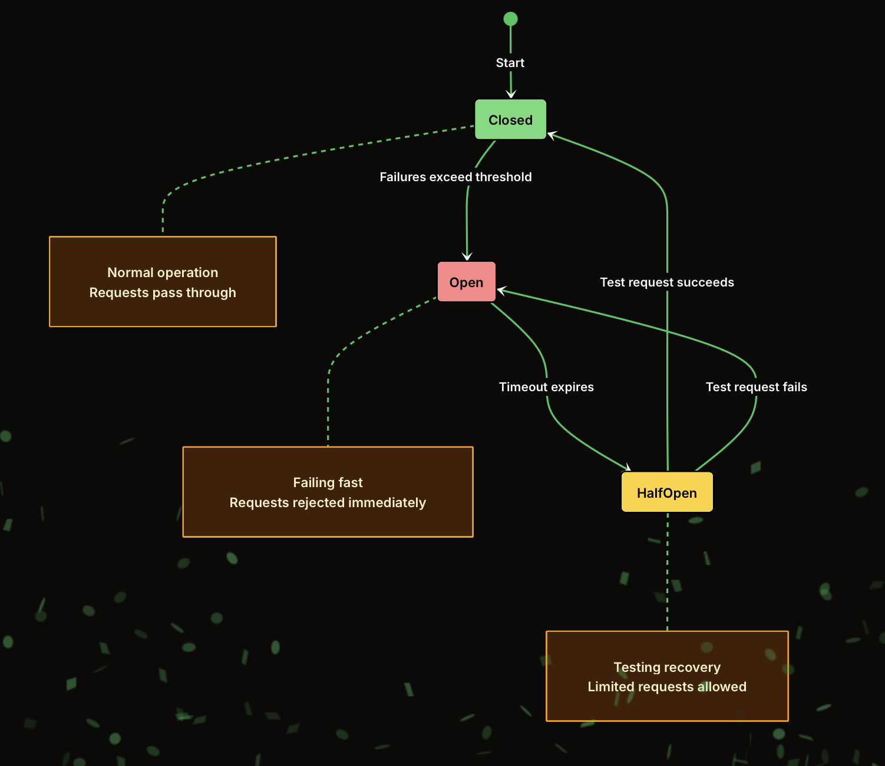
