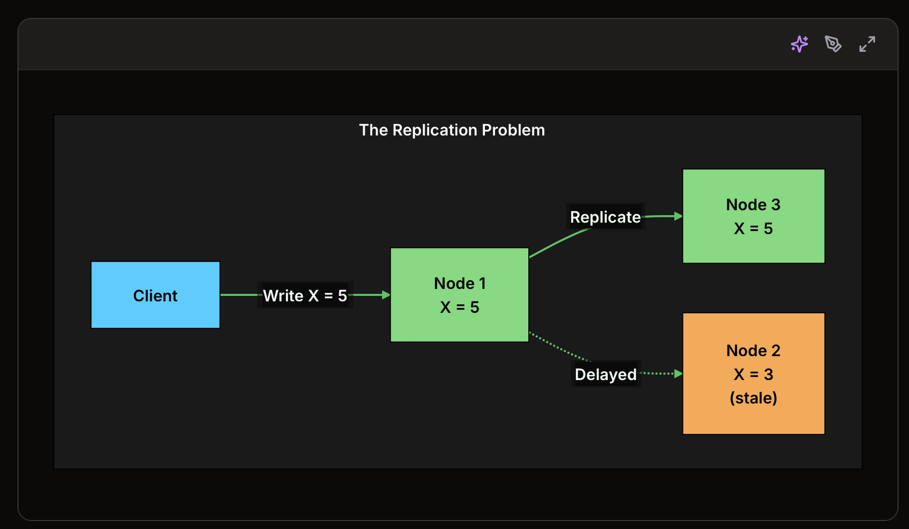
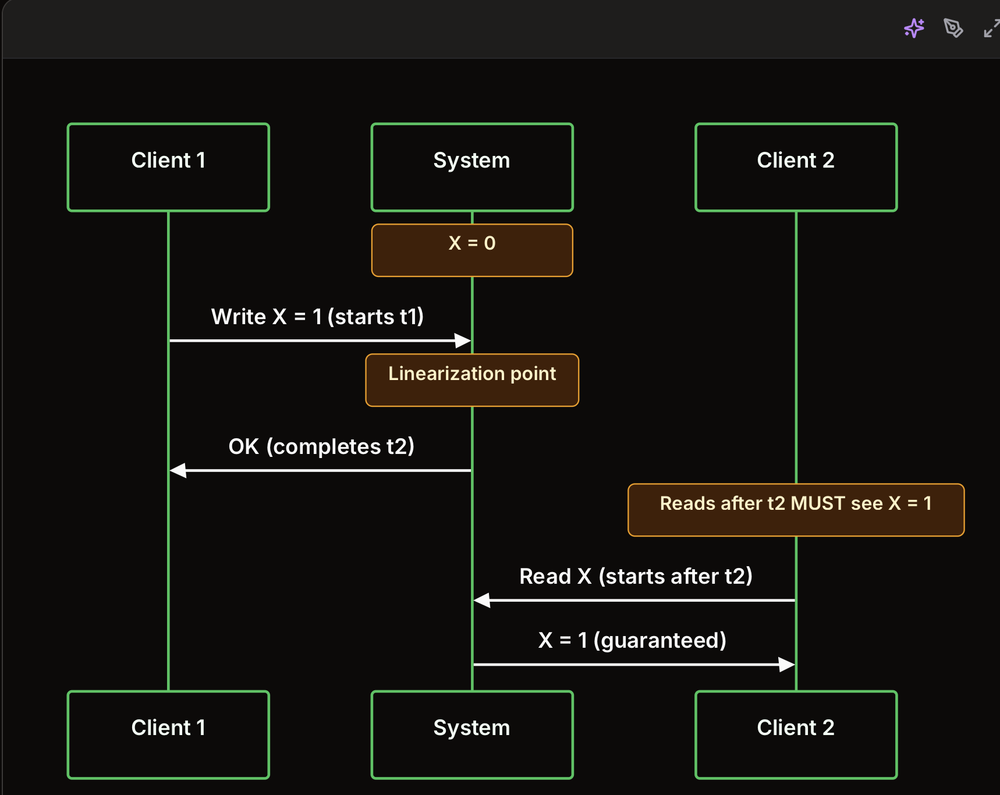

0. Introduction

In modern applications, 
=> data rarely lives in just one place. 
=> spread across multiple servers, potentially in different data centers around the globe.

This distribution brings scalability and resilience, but it also introduces a fascinating challenge: 
=> how do we ensure that all users, and all parts of the system, 
=> see a coherent and correct view of the data, especially when things are changing rapidly?

This is where consistency models come into play.

1. Why Consistency is Hard in Distributed Systems?

On a single machine, consistency is simple
=> One copy of data
=> every read sees the most recent write
=> everything changes when we use replication

A. The Replication Problem

The fundamental question: when a client reads from Node 2, should it get the stale value (X = 3) or should the system prevent this somehow?

When data exists on multiple nodes, those copies can diverge.

=> A write reaches one node before another. 

=> A network hiccup delays propagation. A node restarts and misses updates.

=> The Trade-offs

Stronger Consistency	Cost
All reads see latest write	Higher latency (must coordinate)
No stale data	Lower availability (reject reads during partitions)
Predictable behavior	Lower throughput (serialize operations)

Weaker consistency allows:

Weaker Consistency	Benefit
Reads may be stale	Lower latency (read from any replica)
Replicas may diverge temporarily	Higher availability (serve during partitions)
Operations can proceed independently	Higher throughput (no coordination)

2. The Consistency Spectrum

3. Strong Consistency Models
A. Linearizability

Linearizability guarantees:

+ Real-time ordering: If operation A completes before operation B starts, A happens before B
+ Atomicity: Each operation appears to execute instantaneously at some point
+ Single-copy semantics: The system behaves as if there is one copy of data
