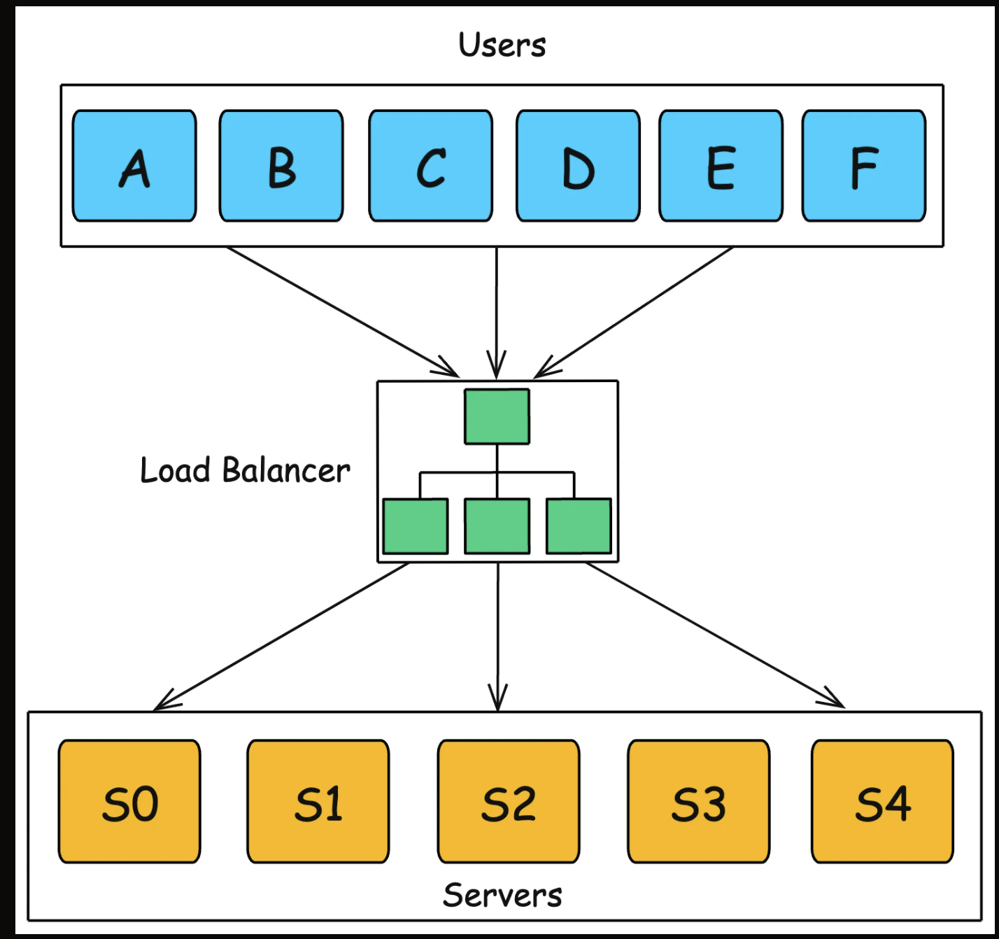
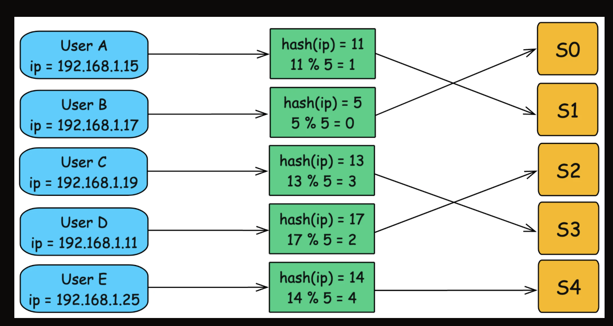
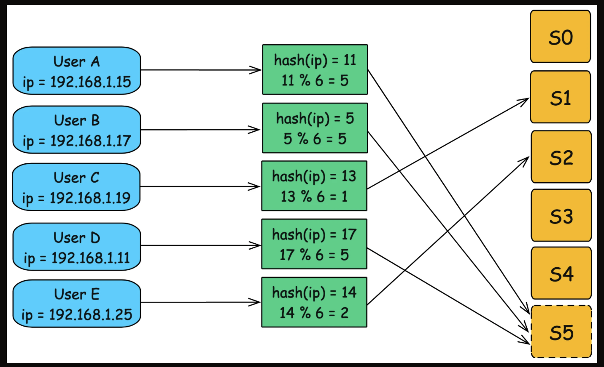
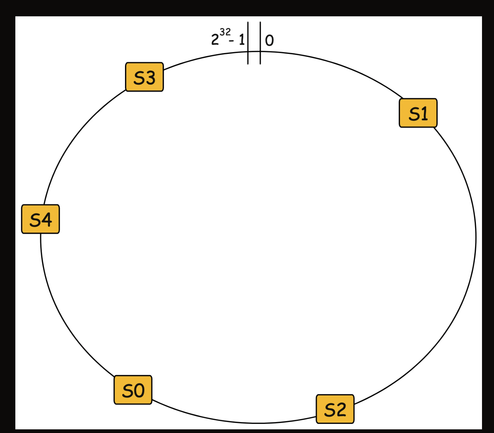
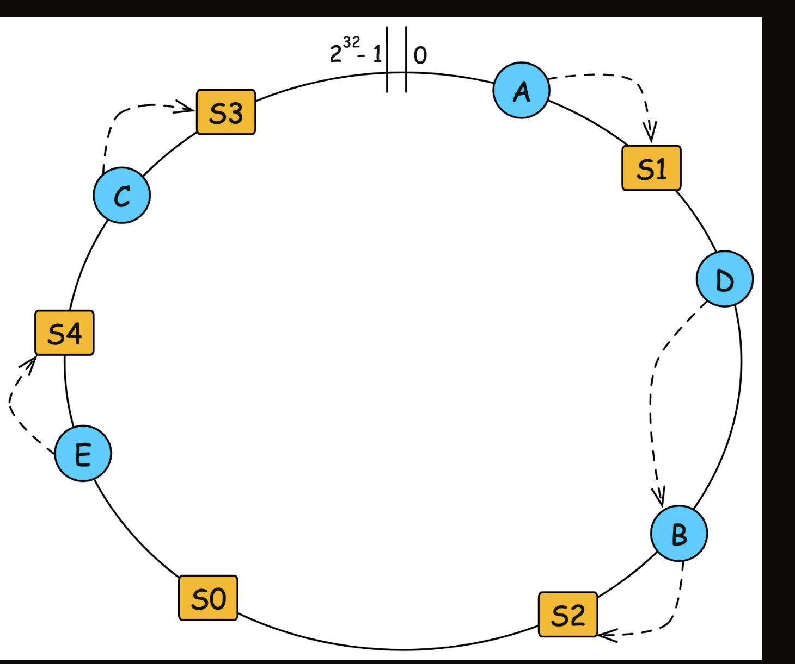
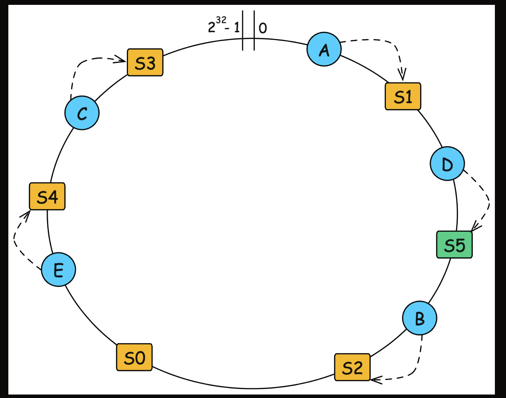
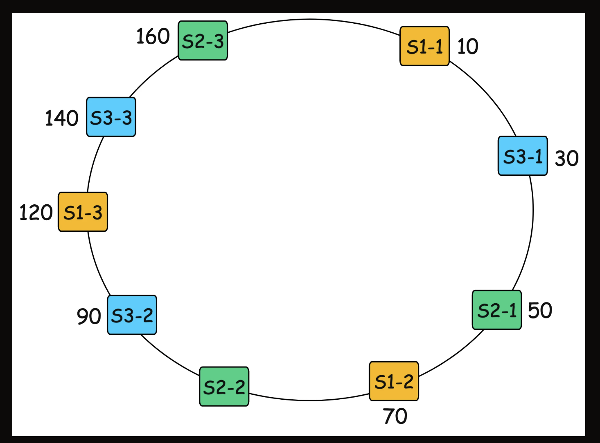

1. Introduction

In a distributed system where nodes (servers) are frequently added or removed, efficiently routing requests becomes challenging.

=> Commonly, use hash the request and assign it to a server using Hash(key) mod N, where N is the number of servers.

=> But, any change in N can lead to significant rehashing, causing a major redistribution of keys
=> Consistent hashing addresses this issue by ensuring that only a small subset of keys need to be reassigned when nodes are added or removed

2. The Problem with Traditional Hashing

A high-traffic web application that serves millions of users daily contains:
+ a hash-based load balancer
+ 5 backend servers (S0, S1, S2, S3, S4), and requests are assigned using a hash function that maps each user's IP address to a specific server.

The process works like this:

+ The load balancer takes a user’s IP address (or session ID).
+ A hash function maps the IP to one of the backend servers by taking the sum of bytes in the IP address and computing mod 5 (since we have 5 servers).
+ The request is routed to the assigned server, ensuring that the same user is always directed to the same server for session consistency.

Everything Works Fine… Until You Scale

A. Scenario 1: Adding a New Server (S5)

Add one more server => N is 6 instead of 5.
Now, the hash function must be modified to use mod 6 instead of mod 5.

=> A seemingly simple change completely disrupts the existing mapping, 
=> causing most users to be reassigned to different servers.
=> massive rehashing, leading to high overhead, and potential downtime

B. Scenario 2: Removing a Server (S4)
Even though only one server was removed, most users are reassigned to different servers.
This can cause:

+ Session Loss: Active users may be logged out or disconnected.
+ Cache invalidation: Cached data becomes irrelevant, increasing database load.
+ Severe performance degradation: The system may struggle to run efficiently.

=> The Solution: Consistent Hashing: Consistent hashing offers a more scalable and efficient solution by ensuring that only a small fraction of users are reassigned when scaling up or down

3. How Consistent Hashing Works

It uses a circular hash space (hash ring) with a large and constant hash space

=> Both nodes (servers, caches, or databases) and keys (data items) are mapped to positions on this hash ring using a hash function.

=> Unlike modulo-based hashing, where changes in the number of nodes cause large-scale remapping.

Note: In consistent hashing, when the number of nodes changes, only k/n keys need to be reassigned, where k is the total number of keys and n is the total number of nodes.

A. Constructing the Hash Ring
Step 1: Defining the Hash Space, We use a large, fixed hash space ranging from 0 to 2^32 - 1 (assuming a 32-bit hash function).

Step 2: Placing Servers on the Ring: Each server (node) is assigned a position on the hash ring by computing Hash(server_id).

and

Using the above example with 5 servers (S0, S1, S2, S3, S4), the hash function distributes them at different positions around the ring.

Step 3: Mapping Keys to Servers

After the servers are placed on the hash ring, every key is also mapped onto the same ring.

Here, a key can be:

+ a user's IP address
+ a session ID
+ a cache key
+ a database record key
+ any request identifier that should be routed consistently

Example:

+ A user's request comes from IP address `192.168.1.10`.
+ The load balancer computes `Hash(192.168.1.10)`.
+ The result places the request somewhere on the hash ring.
+ From that position, we move clockwise until we find the next server.
+ If the next server is `S2`, then this user's request is routed to `S2`.

So the rule is:

=> A key belongs to the first server found when moving clockwise from the key's hash position.

This is why the same key usually maps to the same server every time.

what makes consistent hashing more stable when servers are added or removed.

B. Adding a New Server

Suppose we add a new server (S5) to the system.

+ The position of S5 falls between S1 and S2 in the hash ring.
+ S5 takes over all keys (requests) that fall between S1 and S5, which were previously handled by S2.
+ Example: User D’s requests which were originally assigned to S2, will now be redirected to S5.

C. Removing a Node

4. Virtual Nodes

In basic consistent hashing, each server is assigned a single position on the hash ring. However, this can lead to uneven data distribution, especially when:

+ The number of servers is small.
+ Some servers accidentally get clustered together, creating hot spots.
+ A server is removed, causing a sudden load shift to its immediate neighbor.

Virtual nodes (VNodes) are a technique used in consistent hashing to improve load balancing and fault tolerance by distributing data more evenly across servers.

A. How Virtual Nodes Work

If S1 fails, all its keys must be reassigned to S2, which can create an overload.

