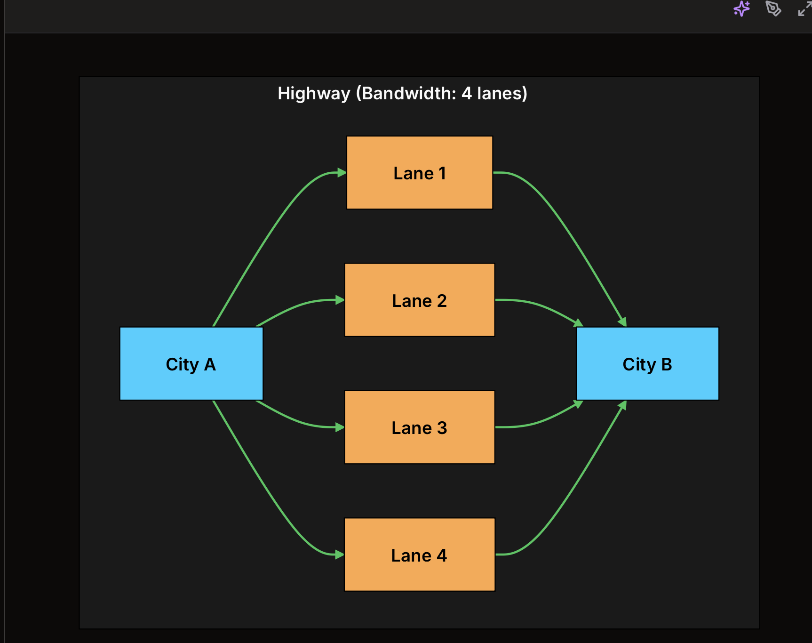
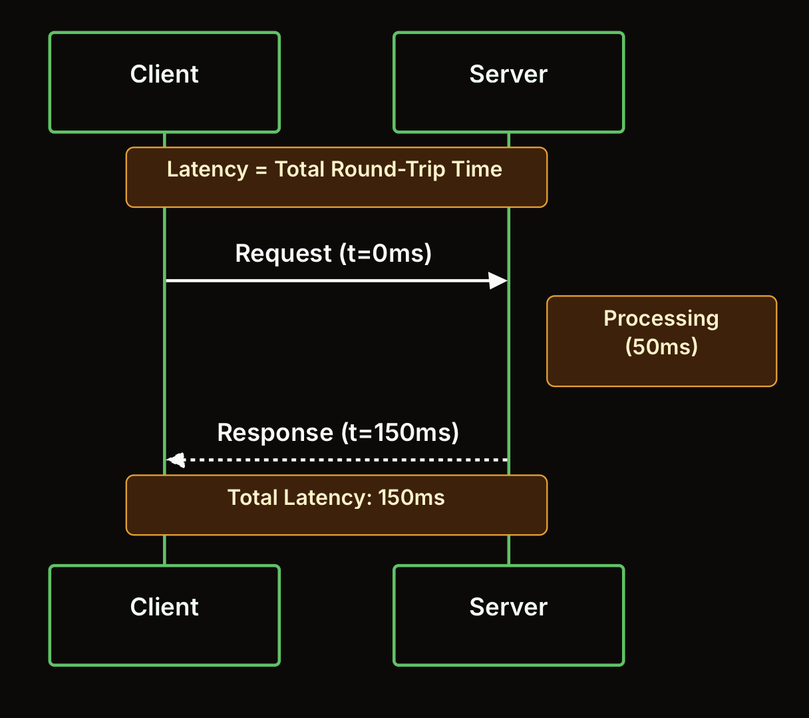
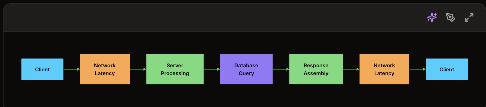
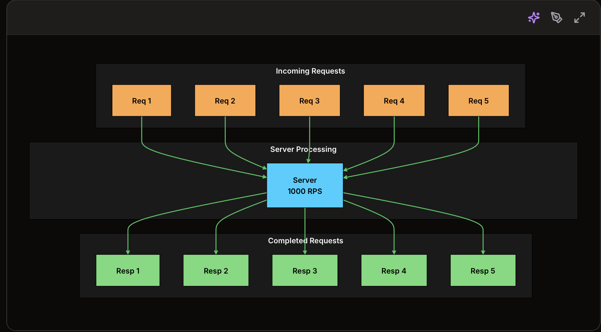
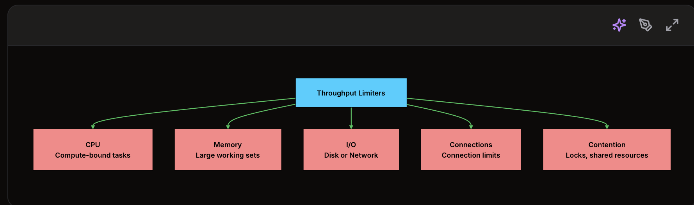
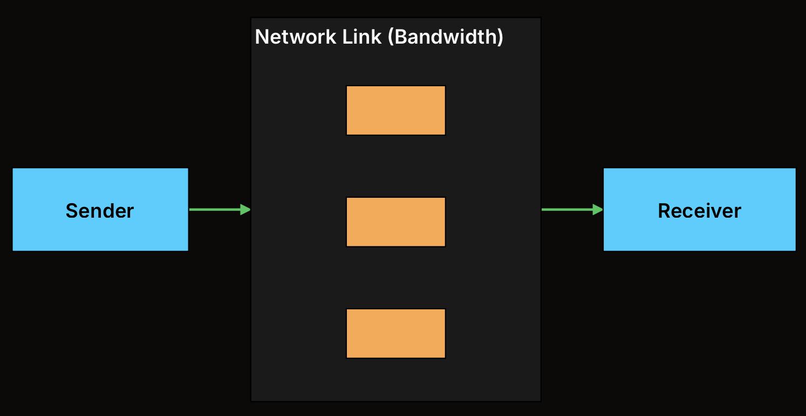

1. Introduction:

Latency = độ trễ: Là thời gian để một request đi từ lúc bắt đầu đến lúc nhận được phản hồi.
Throughput = lưu lượng xử lý / thông lượng: Là số lượng request/công việc hệ thống xử lý được trong một đơn vị thời gian.
Bandwidth = băng thông: Là lượng dữ liệu tối đa có thể truyền qua network trong một đơn vị thời gian.

These concepts are often confused or used interchangeably, but they measure fundamentally different things.

Understanding these metrics is crucial for:

+ Diagnosing performance bottlenecks
+ Making informed architectural decisions
+ Setting realistic expectations with stakeholders
+ Answering system design interview questions

The Highway Analogy:

Bandwidth giống như độ rộng của con đường.
Latency giống như thời gian một chiếc xe đi từ A đến B.
Throughput giống như số xe đi qua mỗi phút.

Bandwidth is the number of lanes on the highway. More lanes mean more cars can travel simultaneously.
Throughput is how many cars actually pass through per hour. This depends on traffic conditions, not just the number of lanes.
Latency is the time it takes for a single car to travel from one city to the other.

2. Latency

Latency is the time it takes for a single request to travel from source to destination and back. It measures delay.

In networking, latency is often called round-trip time (RTT), the time from sending a request to receiving a response.

Latency is not a single value. It is the sum of multiple delays:

+ Propagation delay: Time for signals to travel through the medium. Light in fiber travels at ~200,000 km/s. A cross-Atlantic request (6,000 km) takes ~30ms just for propagation.

+ Transmission delay: Time to push bits onto the wire. Depends on packet size and link bandwidth.

+ Processing delay: Time for routers, load balancers, and servers to process packets.

+ Queuing delay: Time spent waiting in buffers when components are busy.

What Affects Latency?
Factor	Impact
Geographic distance	More distance = more propagation delay
Network congestion	Causes queuing delays
Server load	Increases processing time
Database queries	Slow queries add latency
DNS resolution	Cold requests need DNS lookup
TLS handshake	Adds 1-2 round trips

Reducing Latency
+ Use CDNs: Serve content from edge locations closer to users
+ Caching: Eliminate round trips by caching at multiple layers
+ Connection pooling: Avoid repeated connection setup
+ Database optimization: Add indexes, optimize queries
+ Geographic distribution: Deploy servers closer to users
+ Protocol optimization: Use HTTP/2, HTTP/3 (QUIC)

3. Throughput
Throughput is the amount of work completed per unit of time. It measures volume.

For web systems, throughput is often expressed as requests per second (RPS) or transactions per second (TPS).

Note:
A common confusion: bandwidth is theoretical maximum capacity, while throughput is actual achieved rate.

You can never have throughput higher than bandwidth, but throughput is almost always lower due to:

+ Protocol overhead (headers, acknowledgments)
+ Congestion and packet loss
+ Processing limitations
+ Inefficient resource utilization

Calculating Throughput:
-> For a single-threaded system: 

Throughput = 1 / Latency

If latency = 10ms:
Throughput = 1 / 0.01s = 100 requests/second

-> For a multi-threaded system:

Throughput = Concurrent Workers / Latency

If latency = 10ms and 50 workers:
Throughput = 50 / 0.01s = 5,000 requests/second

What Limits Throughput?

Improving Throughput
+ Horizontal scaling: Add more servers
+ Vertical scaling: Add more CPU, memory
+ Async processing: Do not block on slow operations
+ Batching: Process multiple items together
+ Caching: Reduce work by reusing results
+ Connection pooling: Reuse expensive connections
+ Load balancing: Distribute work evenly

4. Bandwidth
Bandwidth is the maximum rate at which data can be transferred. It measures capacity.

Bandwidth is typically expressed in bits per second (bps): Kbps, Mbps, Gbps.

Types of Bandwidth:

Network bandwidth	Capacity of network links (1 Gbps Ethernet)
Memory bandwidth	Rate of data transfer to/from RAM (DDR4: ~25 GB/s)
Disk bandwidth	Read/write speed of storage (SSD: ~500 MB/s)
Bus bandwidth	Internal data transfer rate (PCIe 4.0: ~64 GB/s)

Bandwidth-Delay Product: Bandwidth-Delay Product (BDP) = Bandwidth × Latency
=> how much data can be "in flight" at any moment.

Example:

+ Bandwidth: 1 Gbps = 125 MB/s
+ Latency: 100ms (coast-to-coast US)
+ BDP: 125 MB/s × 0.1s = 12.5 MB
