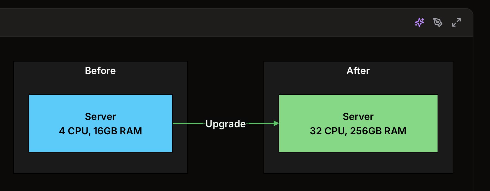
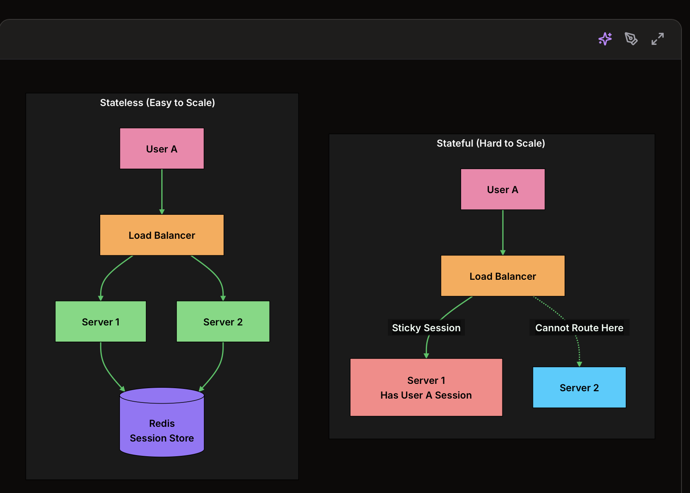
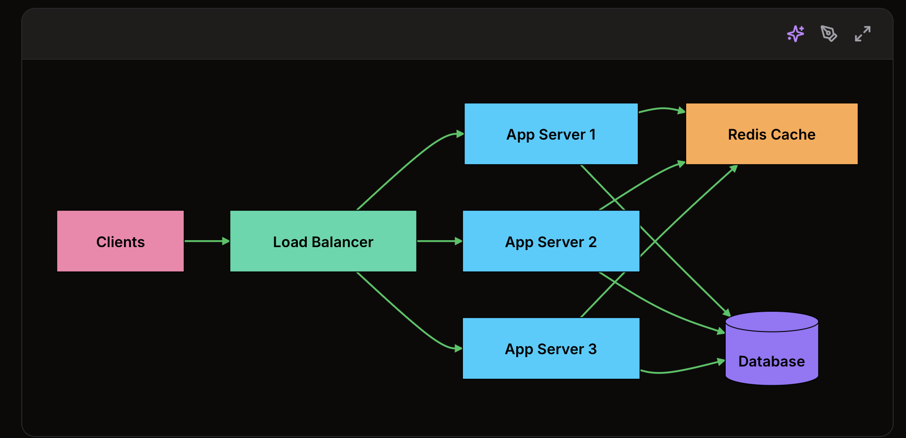
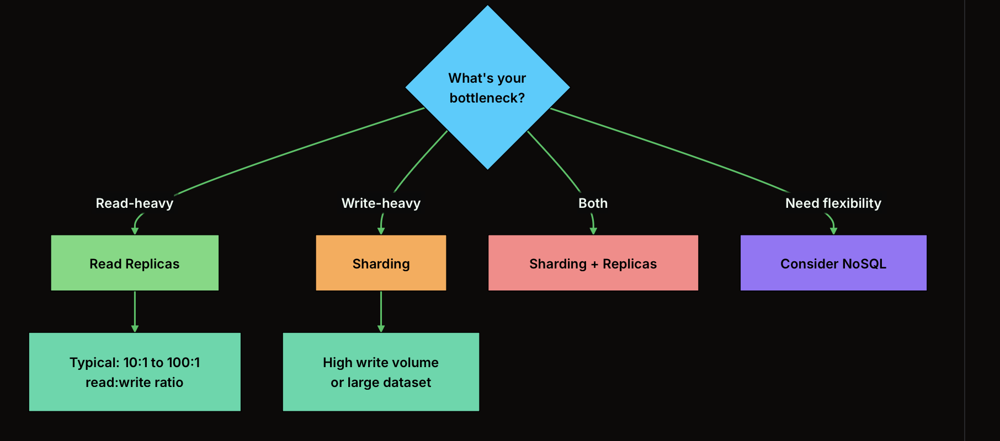
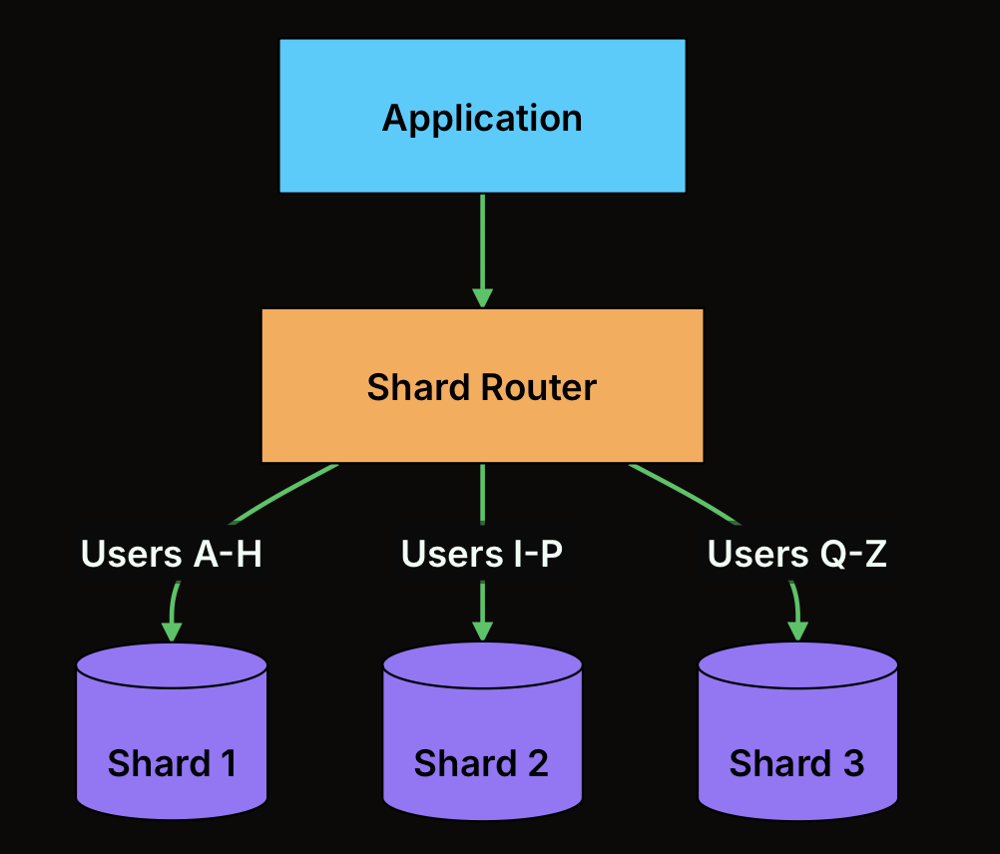
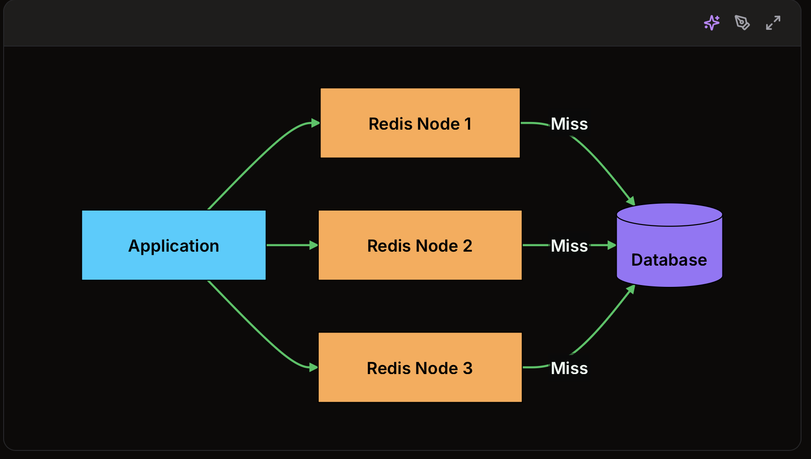
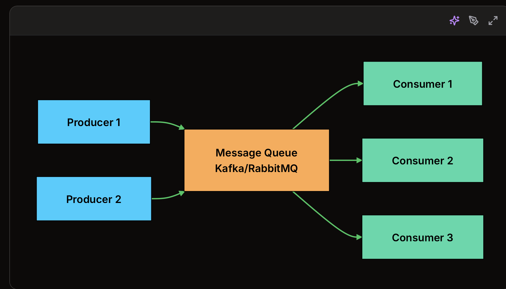

1. What is scalability?
-> The ability of a system to handle increased load by adding more resources

2. Measuring Scalability
Before scaling, you need to understand how to measure it. You cannot improve what you do not measure.

Load Metrics
Metric	Description	Example
Requests per second (RPS)	Number of API calls the system handles	10,000 RPS
Concurrent users	Users active at the same time	50,000 concurrent
Data volume	Amount of data stored or processed	10 TB storage
Throughput	Data transferred per unit time	1 GB/s
Query rate	Database queries per second	50,000 QPS
Message rate	Messages processed through queues	100,000 msg/s

Performance Under load

Load Increase	Response Time	Behavior	What It Means
1x (baseline)	50ms	Baseline	Normal operation
2x	55ms	Excellent	Sublinear growth, caching working well
5x	70ms	Good	System handling load efficiently
10x	150ms	Acceptable	Linear degradation, predictable
10x	500ms	Concerning	Superlinear degradation, bottleneck forming
10x	Timeout	Critical	System at breaking point

-> The goail is to keep performance relationly stable as load increase

3. vertical Scaling (Scale Up)

Vertical scaling means adding more power to your existing machines. Instead of adding more servers, you upgrade to bigger ones.

Common Vertical Scaling Actions
+ Add more CPU cores for compute-intensive workloads
+ Increase RAM to cache more data in memory
+ Use faster SSDs to reduce I/O bottlenecks 
+ Upgrade network cards for higher bandwidth - Bandwidth means how much data can move through a connection per second. NIC / Network Interface Card, is hardware that lets a computer/server connect to a network.

PROS: Simple (no code changes required), lower latency (no network hops), no distrubuted complexity (no netword partition, no chronization issues) 

+ A network hop is one step that data takes when traveling from one machine to another through the network.

Your service (Each -> can be considered a hop)
  -> load balancer
  -> API gateway
  -> another service
  -> database

Cons: Hardware limits, SPOF, Cost curve, downtime during upgrade

When to Use Vertical Scaling:

Vertical scaling works well for:
+ Early-stage startups that need simplicity over scale
+ Workloads with predictable, moderate growth

4. Horizontal Scaling (Scale Out)

Horizontal scaling means adding more machines rather than upgrading existing ones. Instead of one powerful server, you distribute the load across many commodity servers.

Pros: No hard limit (cloud providers make this nearly unlimited), Fault tolerances (No SPOF), Cost effective, Geographic distribution (Place servers closer to users for lower latency)

Cons: Complexity, Data consistency, network overhead (communication between servers add latency), stateless requirements (application servers need to be stateless)

5. Stateless vs Stateful Services

- A stateless service does not store any session data locally. Each request can be handled by any server.

- In the stateful model, once a user's session is stored on Server 1, all their requests must go to that same server. This creates hotspots and makes it risky to remove servers.

- In the stateless model, session data lives in a shared store like Redis, so any server can handle any request. The load balancer has complete freedom to distribute traffic.

To make services stateless:

+ Store session data in a shared cache (Redis, Memcached)
+ Use tokens (JWT) instead of server-side sessions
+ Store uploaded files in object storage (S3) instead of local disk

6. Scaling Different Components

A. Application Tier

Key strategies:
+ Make services stateless
+ Use a load balancer to distribute traffic
+ Auto-scale based on CPU, memory, or request count
+ Deploy across multiple availability zones

B. Database tier
Databases are typically the hardest to scale because they manage state. 

B1. Read Replicas: create copies of your database that handle read queries. Primary handles all writes, replicas receive changes and serve reads.

B2. Sharding (Partitioning); When read replicas are not enough, or when write volume exceeds what a single primary can handle, you need to split your data across multiple databases based on a partition key.

Common sharding strategies:
+ Range-based: Shard by value ranges (A-H, I-P, Q-Z)
+ Hash-based: Hash the key and mod by number of shards
+ Directory-based: Maintain a lookup table mapping keys to shards

B3. NoSQL Databases
Pros: Built-in sharding (automatic distribution), designed for horizontal scale, often better write performance, schema flexibility

Cons: Different query patterns than SQL, no joins (denormalization required), eventual consistency in many cases, less tooling ecosystem than SQL

C. Caching tier

Cache Scaling strategies:
Redis Cluster: Automatically partitions data across nodes using hash slots

Consistent hashing: Distributes keys evenly and minimizes redistribution when nodes are added or removed

Cache-aside pattern: Application checks cache first, falls back to database on cache miss, then populates the cache

D. Message Queue Tier

How queues help scalability:
+ Decouple producers and consumers: Scale each independently
+ Buffer traffic spikes: Queue absorbs bursts, consumers process at their own pace
+ Partition topics: Kafka partitions allow parallel consumption