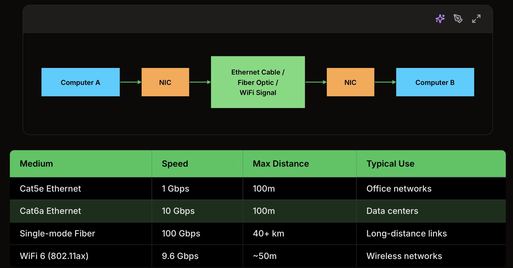
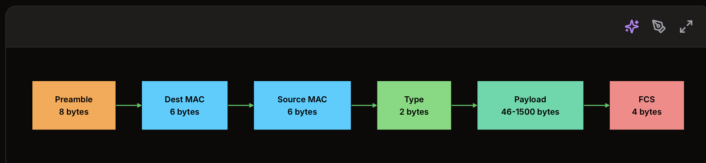
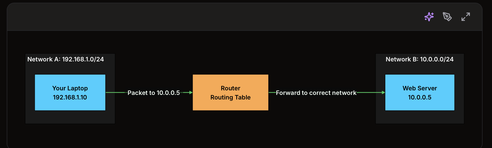
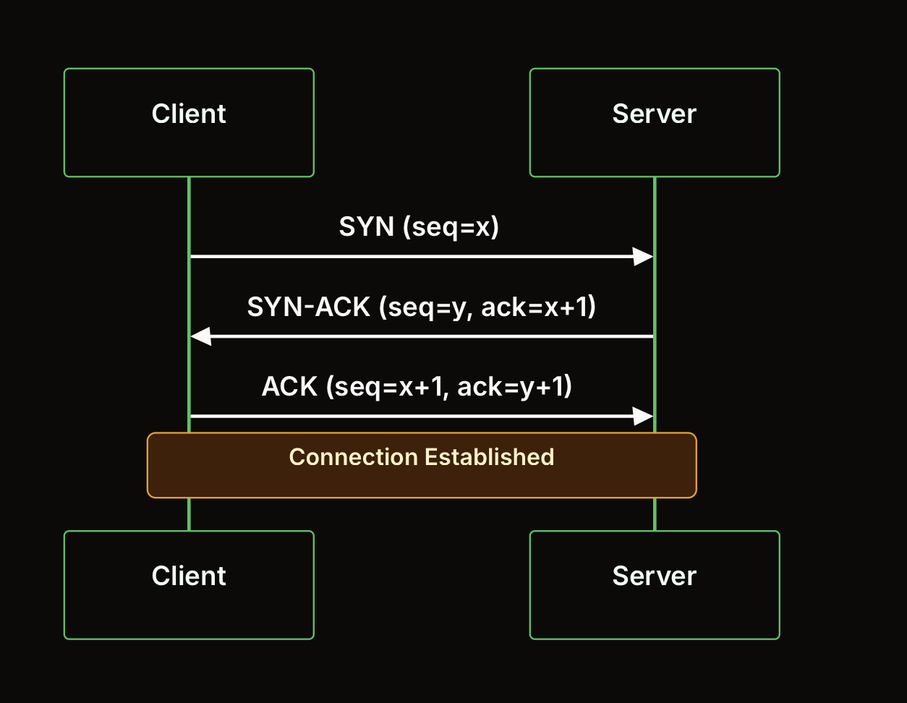
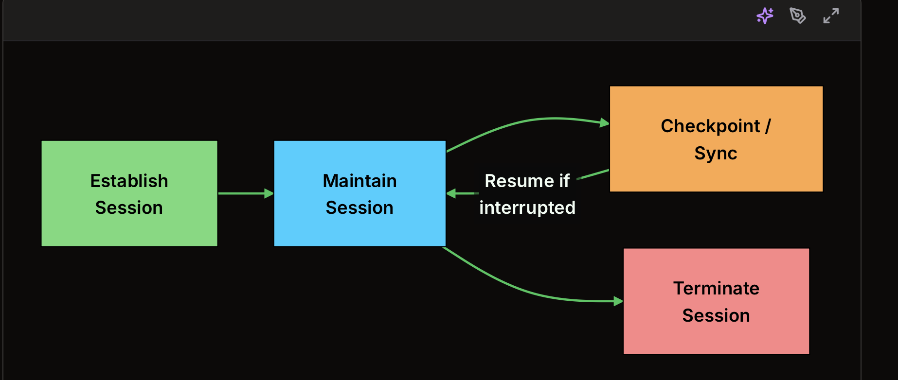
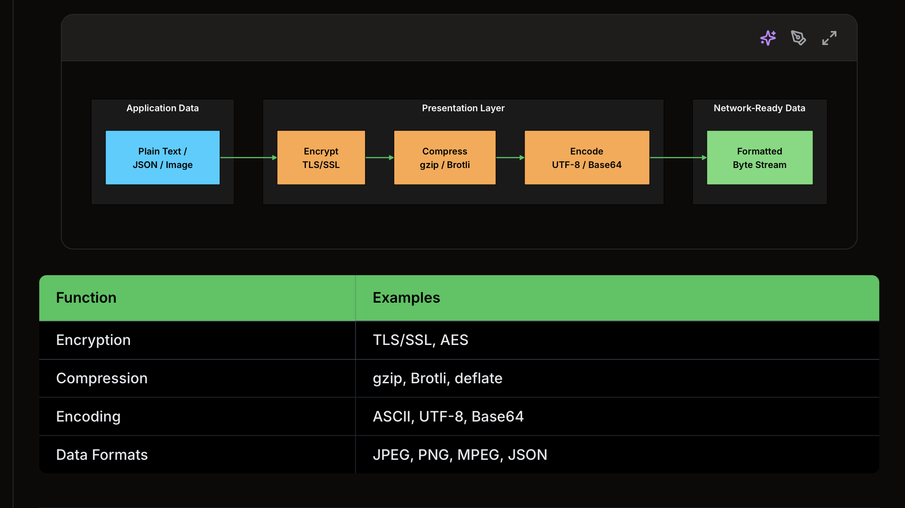
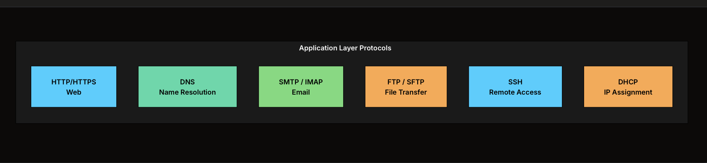
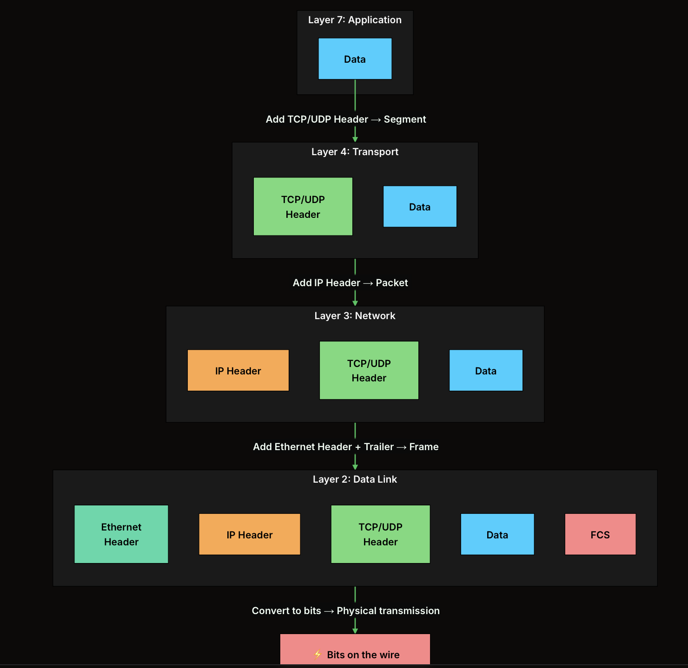

1. Why Does the OSI Model Exist?

2. The 7 Layers Explained

A. Layer 1: Physical

+ deals with raw bits traveling over a medium - Tầng này xử lý việc truyền các bit dữ liệu thô qua một môi trường truyền dẫn.
+ electrical signals on copper wire - tín hiệu điện chạy qua dây đồng.
+ Light pulses through fiber optic cables - Xung ánh sáng truyền qua cáp quang.
+ Radio waves for WiFi

=> This layer has no idea what the bits mean. It just moves them from point A to point B.

The devices here are hubs, repeaters, cables, and Network Interface Cards (NICs)

B. Layer 2: Data Link

Layer 1 can move bits, but it has no concept of structure or addressing
=> The Data Link layer fixes that by organizing bits into frames and introducing MAC addresses
=> unique hardware identifiers burned into every network interface. - Mỗi card mạng / giao diện mạng đều có một mã định danh phần cứng duy nhất được gắn sẵn từ nhà sản xuất.

=> A MAC address looks like 00:1A:2B:3C:4D:5E. It's 48 bits long and uniquely identifies a device on a local network.

Its job is to:
+ package bits into frames
+ use MAC addresses to identify local devices
+ detect transmission errors using checksums
+ control which device gets to use the shared medium at any given time

A switch:
+ reads the destination MAC address in each frame, 
+ looks it up in its MAC address table, and 
+ forwards the frame only to the correct port.

+ Preamble - 8 bytes: Phần mở đầu để thiết bị nhận “bắt nhịp” tín hiệu. Nó giúp receiver biết rằng một Ethernet frame sắp bắt đầu.

+ Dest MAC - 6 bytes: Địa chỉ MAC của thiết bị nhận. Switch thường nhìn vào phần này để biết nên chuyển frame tới cổng nào.

+ Source MAC - 6 bytes: Địa chỉ MAC của thiết bị gửi. Đây là “định danh phần cứng” của network interface gửi frame.

+ Type - 2 bytes: Cho biết payload bên trong là loại dữ liệu gì. Ví dụ:

0x0800 -> IPv4
0x0806 -> ARP
0x86DD -> IPv6
+ Payload - 46 đến 1500 bytes: Đây là dữ liệu thật được chở bên trong frame. Thường payload là một IP packet từ Layer 3.

+ FCS - 4 bytes: Frame Check Sequence. Dùng để kiểm tra lỗi khi truyền. Nếu frame bị lỗi, thiết bị nhận sẽ drop frame đó.

Sublayer	Function
LLC (Logical Link Control)	Flow control, error checking
MAC (Media Access Control)	Addressing, medium access

But Layer 2 only works within a single network. To reach a device on a different network, you need Layer 3.

C. Layer 3: Network

The Network layer is what lets your laptop in New York talk to a server in Tokyo. 

=> It handles routing: figuring out a path across multiple networks to reach the destination.

It 
+ assigns logical addresses (IP addresses), 
+ routes packets between networks, 
+ breaks up packets that are too large for a link (fragmentation), and 
+ figures out the best path to the destination.

Routers live at Layer 3. They 
+ read the destination IP address in each packet and 
+ forward it toward its destination, one hop at a time.

Protocol	Purpose
IP (IPv4/IPv6)	Addressing and routing
ICMP	Error reporting, diagnostics (ping)
ARP	Mapping IP addresses to MAC addresses
OSPF, BGP	Routing protocols for finding best paths

Worth noting the difference between MAC and IP addresses. 
+ MAC addresses are permanent, burned into hardware. 
+ IP addresses are logical and can change. 
You need both: MAC addresses handle local delivery within a network (Layer 2), while IP addresses handle routing across networks (Layer 3).

But Layer 3 only gets packets to the right machine. It doesn't know which application on that machine should receive the data.

D. Layer 4: Transport

That's where the Transport layer comes in. It adds ports, numbers that identify which application should handle incoming data

+ A web server listens on port 443 (HTTPS). 
+ An SSH server listens on port 22. 
+ The combination of IP address + port is what we call a socket.

Beyond addressing, it handles 
+ breaking large chunks of data into smaller segments, 
+ managing flow control so a fast sender doesn't overwhelm a slow receiver, and 
+ giving you a choice between reliability (TCP) or speed (UDP).

TCP and UDP are the two protocols you'll see here, and choosing between them is one of the most common design decisions in system design

Feature	TCP	UDP
Connection	3-way handshake required	Connectionless
Reliability	Guaranteed delivery, retransmission	Best effort, no guarantees
Ordering	Packets arrive in order	Order not guaranteed
Overhead	Higher (headers, acknowledgments)	Minimal
Use Cases	HTTP, email, file transfer	DNS lookups, video streaming, gaming

Port numbers are divided into ranges:

Range	Type	Examples
0-1023	Well-known	HTTP (80), HTTPS (443), SSH (22)
1024-49151	Registered	MySQL (3306), PostgreSQL (5432)
49152-65535	Dynamic/Ephemeral	Assigned to client-side connections

E. Layer 5: Session

The Session layer manages the lifecycle of connections between applications: 
+ setting them up, 
+ keeping them alive, and 
+ tearing them down.

When you download a large file and the connection drops, 
+ session management decides whether you restart from scratch or resume from where you left off. 

When you're on a video call and your WiFi hiccups for a second, the session layer is what keeps things going.

Protocol	Session Function
NetBIOS	Name resolution and session management
RPC	Remote procedure call sessions
SIP	VoIP session setup and teardown

F. Layer 6: Presentation
The Presentation layer is the translator. It 
+ converts data between the format applications use and the format the network needs.

Three things happen here. 
+ Encryption (TLS/SSL encrypts data before it hits the wire). 
+ Compression (gzip or Brotli shrink the data to save bandwidth). 
+ And encoding (converting between character sets like ASCII and UTF-8, or data formats like JPEG and JSON).

Like the Session layer, Presentation is usually folded into the Application layer in real implementations. 

When your browser establishes an HTTPS connection, it's doing Layer 6 encryption as part of a Layer 7 protocol.

G. Layer 7: Application

This is the layer you interact with most directly. 
+ Every time your browser sends an HTTP request, 
+ Every time you send an email, 
+ Every time your code makes a DNS query, that's Layer 7 at work.

Protocol	Port	Purpose
HTTP	80	Web pages (unencrypted)
HTTPS	443	Secure web pages
FTP	21	File transfer
SSH	22	Secure remote access
SMTP	25	Sending email
DNS	53	Domain name resolution
DHCP	67/68	Dynamic IP assignment

3. How Data Flows: Encapsulation and Decapsulation

Think of it like mailing a letter. 
+ You write the letter (your application data). 
+ You put it in an envelope and write the address (the Network layer adds an IP header). 
+ The postal service puts it in a mail bag with a barcode (the Data Link layer adds a frame header). + The truck carries the bag physically (the Physical layer).

Step by step:

+ The Application layer generates the data, say an HTTP request
+ The Transport layer wraps it with a TCP or UDP header (source port, destination port, sequence numbers), creating a segment
+ The Network layer wraps that with an IP header (source IP, destination IP), creating a packet
+ The Data Link layer wraps that with an Ethernet header and trailer (source MAC, destination MAC, checksum), creating a frame
+ The Physical layer converts the frame into raw bits and sends them over the wire

On the receiving end, the reverse happens. 
This is decapsulation. Each layer 
+ strips off its header, reads what it needs, and 
+ passes the payload up. 
By the time data reaches Layer 7, all the networking headers are gone and the application gets clean data.

Each layer gives its own name to the data unit it works with:

Layer	Data Unit Name
Application (Layer 7)	Data
Transport (Layer 4)	Segment (TCP) / Datagram (UDP)
Network (Layer 3)	Packet
Data Link (Layer 2)	Frame
Physical (Layer 1)	Bits