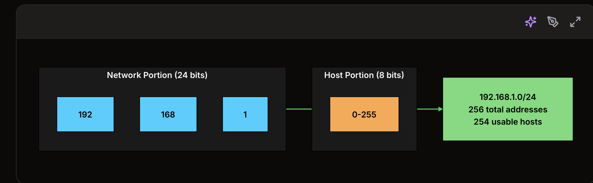
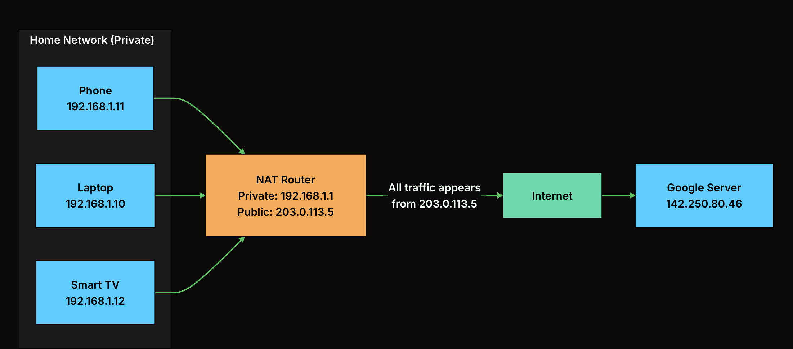

Every device connected to the internet needs a unique way to be identified. 

=> Need a clear addressing system that help data know its destination. This is where IP (Internet Protocol) addresses come in.

An IP address is a unique numerical identifier assigned to a device on a network. 
=> allows routers and networking infrastructure to determine where data should be sent and how it should be routed across the internet.

In this chapter, we will explore what IP addresses are, how they work, and why they are fundamental to internet communication.

1. What Is an IP Address?

An IP (Internet Protocol) address is a unique numerical label assigned to every device on a network. Think of it as a postal address for machines: 
=> it tells the network where to deliver data.

There are two versions in use today.:
+ IPv4 has been around since the 1980s and uses 32-bit addresses like 192.168.1.1. 
=> supports about 4.3 billion unique addresses

+ IPv6 is the replacement, using 128-bit addresses like 2001:0db8:85a3::8a2e:0370:7334, which provides a practically unlimited address space.

IP addresses operate at Layer 3 (Network layer)
=> routing
=>  getting packets from one network to another across the internet

Layer 2 (Data Link) handles local delivery using MAC addresses, but 
+ once a packet needs to leave your local network, IP takes over.

Every IP packet carries two addresses: 
+ the source IP (where it came from) and 
+ the destination IP (where it's going). Routers read the destination IP and forward the packet one hop closer to its target

2. IPv4: The Classic Address Format

An IPv4 address is 32 bits long, written as four decimal numbers separated by dots. 

=> Each number is called an octet because it represents 8 bits

Take the address 192.168.1.25:

`  192    .    168    .     1     .    25
11000000   10101000   00000001   00011001
 (8 bits)   (8 bits)   (8 bits)   (8 bits)`

Address Classes (Historical) (In the early internet)
+ addresses were divided into classes based on the first few bits
+ 

Class	First Octet Range	Default Subnet Mask	Networks	Hosts per Network	Intended Use
A	1-126	255.0.0.0 (/8)	128	~16.7 million	Large organizations
B	128-191	255.255.0.0 (/16)	16,384	~65,000	Medium organizations
C	192-223	255.255.255.0 (/24)	2+ million	254	Small organizations
D	224-239	N/A	N/A	N/A	Multicast
E	240-255	N/A	N/A	N/A	Reserved/experimental

=> The problem was obvious: 
+ A company that needed 300 addresses had to get a Class B with 65,000 addresses => wasting over 99% of them

+ A company that needed 500 addresses couldn't use a Class C (only 254 hosts) and had to jump to a Class B

Classful addressing was replaced in the 1990s by something much more flexible: CIDR.

3. Subnetting and CIDR

The solution: CIDR (Classless Inter-Domain Routing)

A. Subnet Masks and CIDR Notation:

Every IP address is divided into two parts: 
+ a network portion: (which network is this device on?)
+ a host portion (which device on that network?)

=> The subnet mask determines where this split happens.

In CIDR notation, the split is written as a suffix
+ 192.168.1.0/24 means the first 24 bits are the network portion and the remaining 8 bits are for hosts.

Need 1,000 addresses? Use a /22 block (1,024 addresses). 
Need 16? Use a /28. No more waste.

Practical CIDR Calculation
Let's work through 10.0.0.0/20:

/20 means 20 bits for the network, 12 bits for hosts
Host addresses = 2^12 = 4,096 total (4,094 usable)
Range: 10.0.0.0 to 10.0.15.255

CIDR	Subnet Mask	Total Addresses	Usable Hosts	Typical Use
/8	255.0.0.0	16,777,216	16,777,214	Large cloud providers
/16	255.255.0.0	65,536	65,534	Large VPCs, corporate networks
/20	255.255.240.0	4,096	4,094	Medium subnets
/24	255.255.255.0	256	254	Small subnets, most common
/28	255.255.255.240	16	14	Small server groups
/32	255.255.255.255	1	1	Single host (exact match)

B. Cloud Relevance:
Cloud platforms like AWS, GCP, and Azure use CIDR blocks everywhere. 
When you create a VPC (Virtual Private Cloud), 
+ you define its IP range using CIDR. A VPC with 10.0.0.0/16 gives you 65,536 addresses.
+ You then carve it into subnets: 
=> 10.0.1.0/24 for web servers, 
=> 10.0.2.0/24 for databases, 
=> 10.0.3.0/24 for internal services.

=> But not all of these addresses work the same way. Some can reach the internet, and some can't.
=> Public and private IP

4. Public vs Private IP Addresses
+ Some IPs are routable on the public internet. 
+ Others only work within a private network.

A. Public IP Addresses
=> A public IP address is globally unique and reachable from anywhere on the internet
=> Visiting a website, your request goes to a public IP. 
=> When someone pings your home network, they're hitting your public IP.

Public addresses are assigned by Regional Internet Registries (RIRs) and 
=> ISPs get blocks of public IPs and  ()
=> assign them to customers (usually dynamically, so your home IP changes periodically).
(Các nhà mạng / ISP như Viettel, VNPT, FPT sẽ nhận các block public IP từ RIR,
sau đó cấp lại cho khách hàng.)

Địa chỉ IP public được phân bổ bởi các tổ chức quản lý Internet theo khu vực, gọi là RIR.
Chúng là tài nguyên có giới hạn, không phải muốn có bao nhiêu cũng được.

RIR là các tổ chức quản lý và phân phối địa chỉ IP cho từng khu vực trên thế giới. Ví dụ:

ARIN  -> Bắc Mỹ
RIPE  -> Châu Âu, Trung Đông, một phần Trung Á
APNIC -> Châu Á - Thái Bình Dương
LACNIC -> Mỹ Latin
AFRINIC -> Châu Phi

B. Private IP Addresses
Private IP addresses are reserved ranges defined in RFC 1918 that can be used freely within any private network.

Range	CIDR	Addresses	Typical Use
10.0.0.0 to 10.255.255.255	10.0.0.0/8	~16.7 million	Cloud VPCs, large corporate networks
172.16.0.0 to 172.31.255.255	172.16.0.0/12	~1 million	Medium enterprise networks
192.168.0.0 to 192.168.255.255	192.168.0.0/16	~65,000	Home networks, small offices

Your laptop right now probably has an IP like 192.168.1.x. Your neighbor's laptop might also be 192.168.1.x. That's fine because private addresses only need to be unique within their own network.

C. NAT: Bridging Private and Public
=> If private addresses can't reach the internet, how does your laptop browse the web?

Through NAT (Network Address Translation). Your home router has one public IP assigned by your ISP.

When your laptop (say, 192.168.1.10) sends a request to 142.250.80.46 (Google), 
=> the router rewrites the source IP from 192.168.1.10 to its own public IP (say, 203.0.113.5). 

It keeps a translation table so it knows which internal device to forward the response back to.

ISP hoặc cloud provider có một pool public IP.
Router/NAT gateway dùng một hoặc vài public IP trong pool đó
để đại diện cho nhiều private IP phía sau.

D. Cloud Context
In cloud environments, the same public/private split applies. 
+ Your EC2 instances, Kubernetes pods, and RDS databases all get private IPs within the VPC. 
+ Only load balancers and NAT gateways get public IPs that face the internet. 

This is both a cost optimization (public IPs are limited and sometimes charged) and a security measure (internal services are unreachable from outside).

5. IPv6: The Modern Standard
NAT has stretched IPv4's lifespan, but it adds complexity, breaks certain protocols, and makes end-to-end connectivity harder

IPv6 was designed to solve this permanently. With 128-bit addresses, it provides 2^128, or 
=> roughly 340 undecillion (3.4 x 10^38) addresses. 

=> That's enough to assign a unique IP to every atom on Earth's surface and still have addresses left over.

A. Address Format

An IPv6 address is written as eight groups of four hexadecimal digits, separated by colons:
=> 2001:0db8:85a3:0000:0000:8a2e:0370:7334

IPv6 adoption has been gradual but steady. As of 2025, roughly 45-50% of Google's traffic comes over IPv6. Major ISPs and mobile networks have adopted it widely since mobile carriers were among the first to feel the pain of IPv4 exhaustion (every phone needs an IP).

6. Special IP Addresses
Address	Name	Purpose	When You'll See It
127.0.0.1	Loopback	Routes back to your own machine	localhost, local development, health checks
0.0.0.0	All interfaces	Listen on every network interface	Server bind addresses, "unspecified" address
255.255.255.255	Broadcast	Send to all devices on local network	DHCP discovery, ARP requests
10.x.x.x, 172.16-31.x.x, 192.168.x.x	Private	Internal network use (RFC 1918)	VPCs, home networks, corporate LANs
169.254.x.x	Link-local	Auto-assigned when DHCP fails	"No internet" situations, self-configuration
224.0.0.0/4	Multicast	One-to-many delivery	Video streaming, service discovery