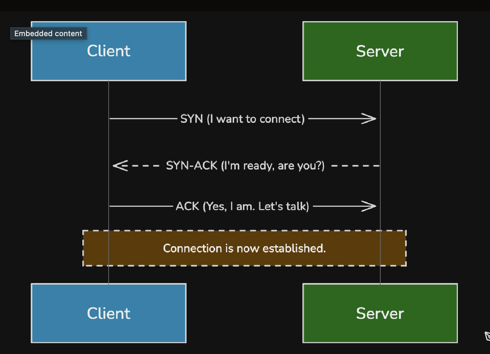
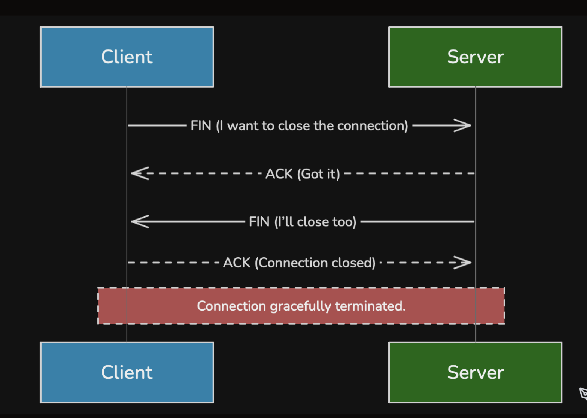
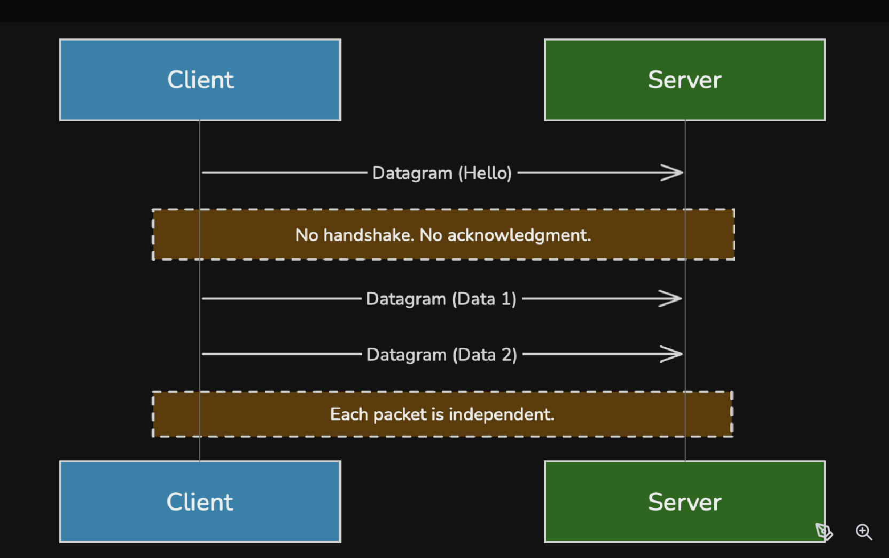
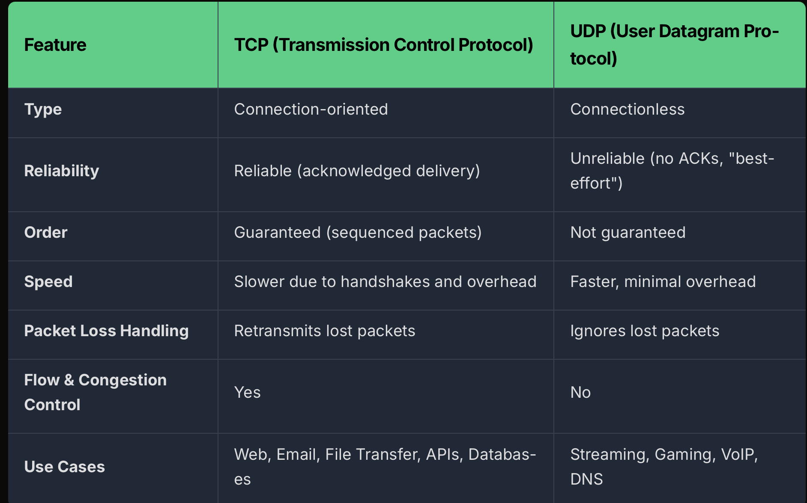

1. The Role of the Transport Layer

While the Network Layer (IP) gets data packets from one computer to another (host-to-host), the Transport Layer gets data from one application to another (process-to-process).

+ Segmentation and Reassembly: Breaking large chunks of application data into smaller packets on the sender's side and reassembling them on the receiver's side.

+ Delivery Model: Providing either a reliable delivery service or a best-effort transmission.

+ Flow and Congestion Control: Managing the rate of data transmission to avoid overwhelming the receiver or the network itself.

This is where TCP and UDP diverge. TCP focuses on 
+ providing a highly reliable, 
+ ordered stream of data, 
while UDP prioritizes speed and simplicity with a best-effort approach.

2. What Is TCP (Transmission Control Protocol)?
A connection-oriented protocol:
+ guarantees the reliable delivery of data
+ meticulous, trustworthy courier 

Before sending any data, TCP establishes a formal connection between the client and server.

Key Characteristics:
+ Connection Establishment: TCP uses a three-way handshake (SYN, SYN-ACK, ACK) to establish a reliable connection. This initial negotiation adds a bit of latency but ensures both sides are ready to communicate.

Reliability: Every packet sent is tracked with a sequence number. The receiver sends acknowledgments (ACKs) for packets it receives. If the sender doesn't get an ACK within a certain time, it retransmits the lost packet.

Ordered Delivery: Sequence numbers also ensure that packets are reassembled in the correct order at the destination, even if they arrive out of order.

Flow & Congestion Control: TCP uses a "sliding window" mechanism to prevent the sender from overwhelming the receiver (flow control). It also intelligently slows down transmission when it detects network congestion (congestion control).

A. Connection Establishment (Three-Way Handshake)

SYN (Synchronize): The client initiates the connection by sending a SYN message, signaling its intent to start communication and sharing its initial sequence number (ISN).

SYN-ACK (Synchronize–Acknowledge): The server receives the SYN, reserves resources for the connection, and responds with a SYN-ACK to acknowledge the request and share its own ISN.

ACK (Acknowledge): The client sends an ACK to confirm receipt of the SYN-ACK, completing the handshake.

=> At this point, both sides have synchronized sequence numbers, and a reliable communication channel is established.

B. Data Transfer

The protocol guarantees that all packets (segments) are delivered in order, without duplication, and without loss.

Segmentation: Large data is broken into smaller, manageable chunks called segments.

Acknowledgments (ACKs): Each segment sent is acknowledged by the receiver. If the sender doesn’t receive an ACK within a set timeout, it retransmits the segment.

Sliding Window: TCP uses a window-based flow control mechanism that allows multiple packets to be “in flight” before requiring an acknowledgment, improving throughput.

Error Detection: Each segment includes a checksum to detect corruption in transit. Corrupted packets are discarded and resent.

C. Connection Termination
When communication is complete, TCP closes the connection gracefully through a four-step termination process. This ensures both client and server agree that the session is finished.

FIN (Finish): The client initiates termination, signaling it has no more data to send.
ACK: The server acknowledges the FIN, allowing any remaining data to be processed.
FIN: The server sends its own FIN to close its side of the connection.
ACK: The client confirms, and both sides release their resources.

3. What Is UDP (User Datagram Protocol)?

UDP is a connectionless protocol that sends data without establishing a formal connection. It operates on a "fire-and-forget" principle

Key Characteristics:
No Handshake: Packets (called datagrams) are sent immediately without any prior negotiation. This significantly reduces initial latency.
No Acknowledgments: UDP doesn't wait for ACKs and doesn't retransmit lost packets. If a packet is dropped, it's gone for good.
No Ordering: There's no guarantee that packets will arrive in the order they were sent.
Lightweight: The UDP header is much smaller (8 bytes) than the TCP header (20+ bytes), meaning less overhead per packet.

A. How UDP Works
UDP doesn’t perform a handshake like TCP. There’s no setup phase, no exchange of sequence numbers, and no acknowledgment of connection readiness.

When an application wants to send data:
+ It creates a datagram, attaches a destination IP and port, and sends it directly to the network.
+ The receiving application (if it’s listening on that port) simply processes the incoming data.
=> eliminates the connection overhead

UDP treats every packet (called a datagram) as an independent message.
=> Each datagram carries its own header information and is routed individually through the network.
=> This makes UDP ideal for real-time communication where dropping a few packets is acceptable but delays are not.

4. Head-to-Head Comparison: TCP vs UDP

5. Modern Innovations

QUIC (Quick UDP Internet Connections)
Developed by Google and now the basis for HTTP/3, QUIC is a game-changer.

It runs over UDP to avoid the initial latency of the TCP handshake.
It builds reliability, congestion control, and stream management directly into its own layer.
It features built-in, mandatory encryption (TLS 1.3).
It supports multiplexing, where multiple data streams can be sent over a single connection without one blocking the others.
Essentially, QUIC provides many of TCP's benefits with the speed of UDP.

Some applications also build their own custom reliability layers over UDP. For example, 
+ a multiplayer game might use UDP for player movement but 
+ implement a simple ACK system for critical events like "player used a special ability."

6. Real-World Use Cases
The choice between TCP and UDP is dictated entirely by the application's requirements.

TCP-Based Systems:
+ Web Traffic (HTTP/HTTPS): When you load a web page, every single byte of HTML, CSS, and JavaScript must arrive correctly and in order. A missing packet could break the page layout or functionality.
+ Databases: A database query or transaction must be 100% complete and correct. You can't afford to have a partially updated record due to a lost packet.
+ Email (SMTP, IMAP): Just like a web page, an email message must be delivered in its entirety to be readable.

UDP-Based Systems:
+ Video Streaming (YouTube, Netflix): If a single frame of a video is dropped, the user might see a tiny glitch or nothing at all. It's better to skip that frame and show the next one in real-time than to pause the entire stream to wait for a retransmission.
+ Online Gaming: In a fast-paced game, receiving slightly outdated information is better than receiving perfect information too late. The game client can often interpolate or predict the missing data.
+ Voice over IP (VoIP - Zoom, WhatsApp Calls): A small, momentary audio dropout is preferable to a long, jarring delay while the system tries to recover a lost packet.