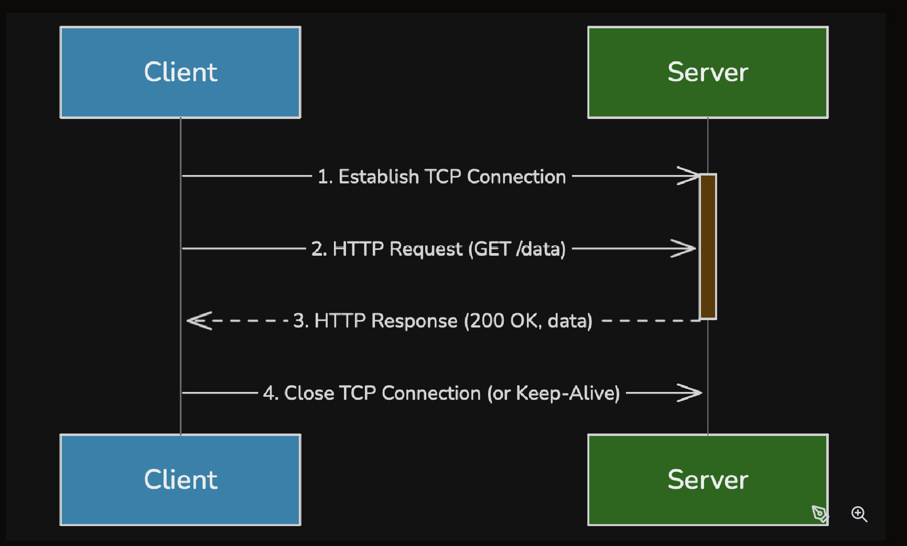

1. What is HTTP?

HTTP (HyperText Transfer Protocol) is a stateless, text-based application-layer protocol used for communication between web clients and servers.

=> standard for transmitting web pages and data over the internet.

Key Characteristics:
+ Application Layer Protocol: HTTP operates at Layer 7 of the OSI model.
+ Client-Server Model: 
+ Built on TCP: HTTP traditionally sits on top of TCP (Transmission Control Protocol) at the Transport Layer, leveraging TCP's reliable, ordered, and connection-oriented delivery. By default, HTTP uses port 80.

2. How HTTP Works

A. TCP Connection: The client first establishes a TCP connection with the server (or reuses an existing one).

B. HTTP Request: The client sends an HTTP request message. This message includes:
+ An HTTP Method (e.g., GET, POST).
+ The URL of the resource.
+ HTTP Headers (key-value pairs providing additional context, e.g., Host, User-Agent).
+ Optionally, a message body (e.g., for POST requests).

C. Server Processing: The server receives the request, processes it (e.g., fetches data from a database, runs business logic).

D. HTTP Response: The server sends an HTTP response message back to the client. This includes:
+ An HTTP Status Code (e.g., 200 OK, 404 Not Found).
+ Response Headers (e.g., Content-Type, Content-Length).
+ The message body (e.g., the requested HTML content, JSON data).

E. Connection Closure/Reuse: The TCP connection is either closed after the response (HTTP/1.0, though uncommon now) or kept open for subsequent requests (HTTP Keep-Alive in HTTP/1.1+).

Statelessness:

In system design, this is both a blessing and a curse:

Pros: Easier to scale, as any server can handle any request without needing prior context.
Cons: Requires mechanisms like cookies, session IDs, or JWTs (JSON Web Tokens) to maintain user state at the application level.

3. HTTP Methods and Status Codes

Method	Use Case	Idempotent?
GET	Retrieve data	Yes
POST	Submit new data, create resources	No
PUT	Update/replace an existing resource	Yes
DELETE	Remove a resource	Yes
PATCH	Apply partial modifications to a resource	No
HEAD	Get headers only, without the response body	Yes

Common HTTP Status Codes:
1xx (Informational): 

Request received, continuing process.
2xx (Success):

200 OK: Request succeeded.
201 Created: Resource successfully created.

3xx (Redirection): Further action needed to complete the request.
301 Moved Permanently: Resource moved.
302 Found: Temporary redirect.

4xx (Client Error):
400 Bad Request: Invalid syntax.
401 Unauthorized: Authentication required.
403 Forbidden: Server understood, but refuses to authorize.
404 Not Found: Resource not found.

5xx (Server Error):
500 Internal Server Error: Generic server error.
502 Bad Gateway: Server acting as gateway received invalid response.
503 Service Unavailable: Server temporarily unable to handle request.

4. Limitations of HTTP

=> No Encryption, No Authentication, No Integrity: (Data transmitted over HTTP can be modified in transit without detection)

5. What is HTTPS?

HTTPS (HTTP Secure) is not a separate protocol but rather HTTP layered on top of SSL/TLS (Secure Sockets Layer / Transport Layer Security). This cryptographic protocol provides secure communication over a computer network. By default, HTTPS uses port 443.

HTTPS provides three core guarantees:
+ Encryption (Confidentiality)
+ Integrity
+ Authentication

The foundation of HTTPS is Public Key Infrastructure (PKI), which uses a combination of public and private keys, along with digital certificates issued by trusted Certificate Authorities (CAs), to establish secure connections.

