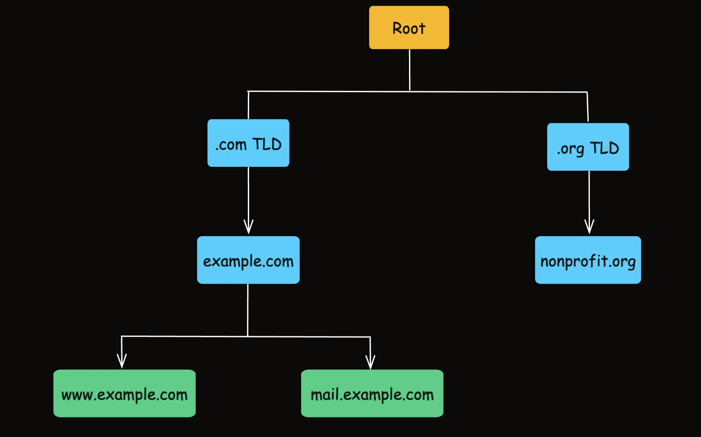

Think of DNS as the phone book of the Internet, 
=> translating easy-to-remember domain names (like www.example.com) into machine-friendly IP addresses (like 93.184.216.34).

The Domain Name System (DNS) is a distributed, hierarchical system designed to 
=> translate human-readable domain names into IP addresses, which are 
=> necessary for locating and communicating with servers on the Internet.

1. How DNS Works

When you enter a domain name in your browser, a series of steps occur to translate that name into an IP address.

A. User Request: You type  into your browser.

B. DNS Resolver server (Recursive Resolver): Your computer sends the request to a DNS resolver server provided by your Internet Service Provider (ISP) or a public DNS service (like Google DNS or Cloudflare).

C. Root Name Server Query: The resolver first queries a root name server, which doesn’t know the exact IP but can direct the resolver to the appropriate Top-Level Domain (TLD) server.

=> The DNS hierarchy is like this:

Root
 └── .com -> TLD
      └── example.com
           └── www.example.com

Khi resolver hỏi root server: Where is example.com?
=> root server trả lời kiểu: Ask the .com TLD name servers.

D. TLD Name Server Query: The resolver then contacts the TLD server (for .com in our example) to get further guidance.

E. Authoritative Name Server Query: Finally, the resolver queries the authoritative name server for  to obtain the precise IP address.

F. Response to User: The IP address is returned to your browser, and you’re directed to the website.

2. The Hierarchical Structure of DNS
DNS is designed as a hierarchical system, much like a tree:

+ Root Level: At the top are the root servers, which know where to find the TLD servers.
+ Top-Level Domains (TLDs): These are the next layer, like .com, .org, .net, etc.
+ Second-Level Domains: These are the domain names you register (e.g., example in example.com).
+ Subdomains: These can be added to further organize the domain (e.g., www or blog).

3. DNS Components and Their Roles

Root Name Servers
+ Role: The starting point for DNS resolution. They direct queries to the appropriate TLD servers.
Quantity: There are 13 logical root servers (labeled A through M), operated by various organizations worldwide.

Top-Level Domain (TLD) Servers
+ Role: These servers manage the next layer of the domain hierarchy. For instance, the .com TLD server directs queries for domains ending in .com.

Example: When resolving , the root server points to the .com TLD server.

Authoritative Name Servers
+ Role: These servers contain the definitive information about a domain, including its IP address and DNS records (such as A, AAAA, MX, etc.).

Importance: They provide the final answer in the DNS resolution process.

DNS Resolvers
+ Role: Resolvers (or recursive resolvers) are the intermediaries that handle DNS queries from clients. They communicate with root, TLD, and authoritative servers to retrieve the required information.
Caching: They cache responses to speed up subsequent queries.

4. Caching in DNS

Caching in DNS that improves performance by storing previously resolved queries for a predetermined period (Time-To-Live, or TTL). 

=> This means that if another user requests the same domain, the resolver can return the cached IP address quickly without going through the entire resolution process again.

=> Reduced Latency, Lower Load on Servers, Improved Scalability