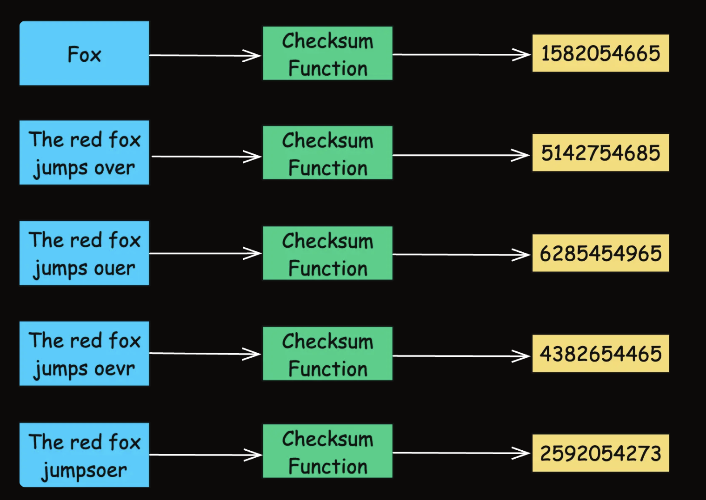
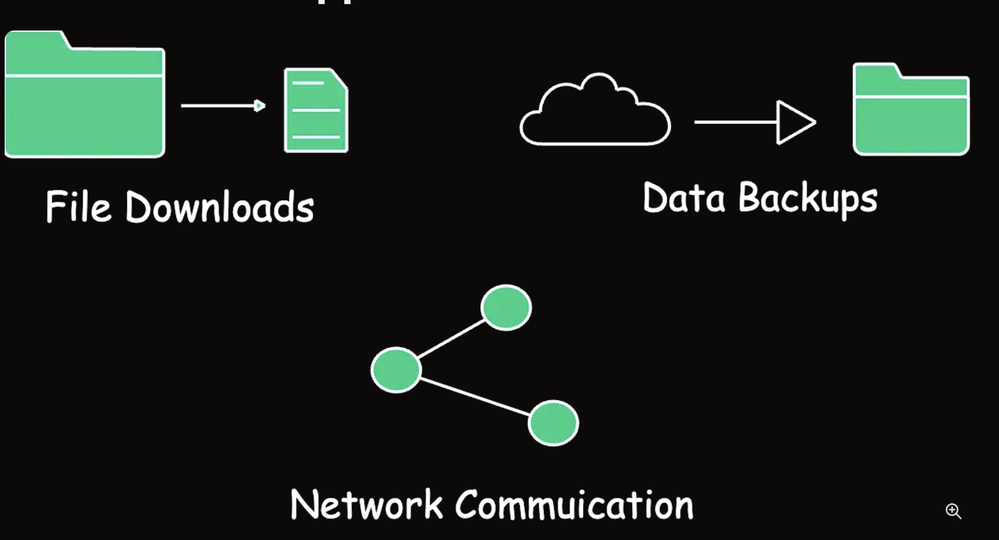

Imagine you're sending an important letter to your friend through the mail.

=> Before sealing the envelope, you take a photo of the letter.

=> When your friend receives it, they take a photo of the letter and send it back to you.

If the two photos match, you know the letter hasn't been tampered with or damaged during transit.

=> In the digital world, checksums serve a similar purpose as those photos. 
~~ help us answer the question: “Has the letter been altered or damaged“,
~~ "Has this data been altered unintentionally or maliciously since it was created, stored, or transmitted?"

1. What is a Checksum?

A checksum is a unique fingerprint attached to the data before it's transmitted.

=> When the data arrives at the recipient's end, 
=> the fingerprint is recalculated to ensure it matches the original one.

calculated by: performing a mathematical operation on the data
+ adding up all the bytes
+ running it through a cryptographic hash function.

2. How Does a Checksum Work?
The process of using a checksum for error detection is straightforward:

+ Calculation: Before sending or storing data, the original data is processed through a specific algorithm to produce a checksum value.

+ Transmission/Storage: The checksum is appended to the data and sent over the network or saved in storage.

+ Verification: Recalculate

+ Error Detection: If the two checksum values match, the data is considered intact. If they do not match, it indicates that the data has been altered or corrupted during transmission or storage.

3. Types of Checksums

+ Party bit: Add 1 extra bit so the total number of 1s is even or odd

+ CRC (Cyclic Redundancy Check): A common real-world example is Ethernet.

=> Each Ethernet frame has an FCS field: (Frame Check Sequence)
Data: "123456789"
CRC-32: 0xCBF43926
=> The sender sends: data + CRC: The receiver recomputes CRC from the received data. If the CRC does not match, the frame is considered corrupted and dropped.

+ Cryptographic Hash Functions: used for (MD5, SHA-1, and SHA-256)

file integrity checks
software downloads
digital signatures
Git objects
security verification

4. Real-World Applications of Checksums

