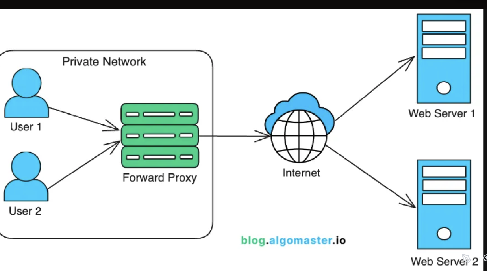
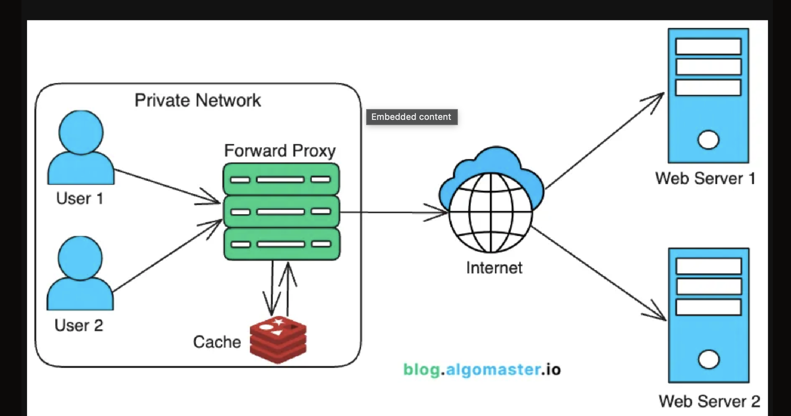
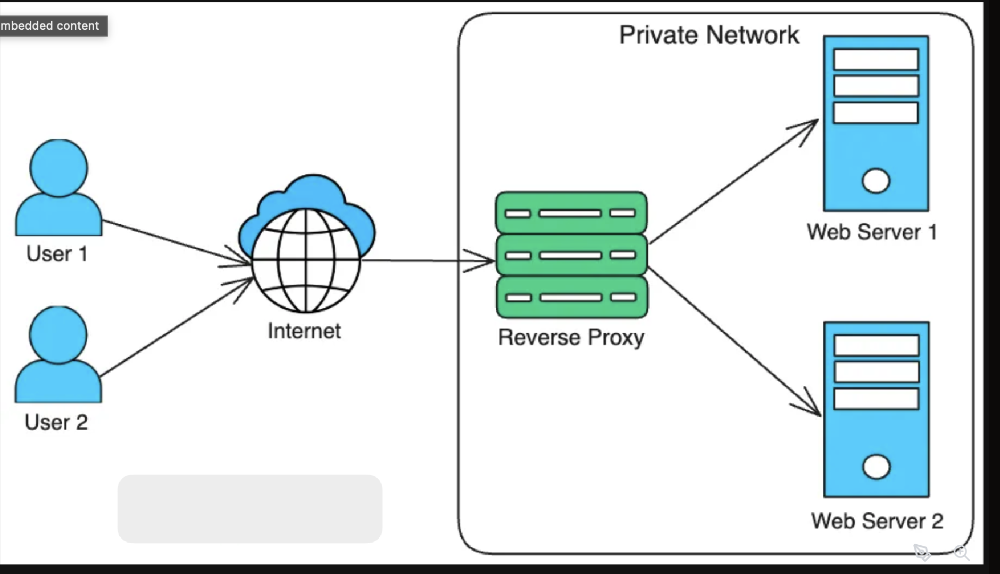
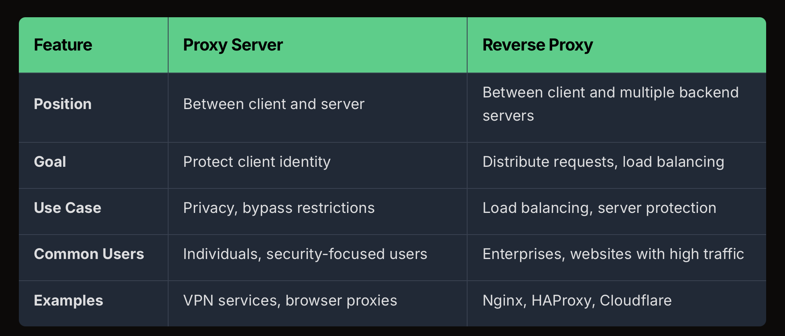

+ Proxies and reverse proxies are servers that sit between clients and servers to improve security, privacy and performance.

=> A Proxy server (sometimes called a Forward proxy) acts on behalf of clients
=> while a Reverse Proxy acts on behalf of servers.

1. What is a Proxy Server?
=> A proxy is an entity that has the authority to act on behalf of another.

When you send a request, like opening a webpage, 
=> the proxy intercepts it, forwards it to the target server, and then relays the server’s response back to you.

- a simplified example:
+ The user types a website URL into their browser.
+ The request is intercepted by the proxy server instead of going directly to the website.
+ The proxy server examines to decide if it should forward it, deny it, or serve a cached copy
+ If deciding to forward, it contacts the target website.(website only see the proxy's IP)
+ The tảget website responds, the proxy receives the respóne and relays it to the user

Key Benefits of Proxy Servers:
+ Privacy and Anonymity: hide your IP address by using their own
+ Access Control: Organizations use proxies to enforce content restrictions, monitor internet usage.
+ Security: Proxies can filter out malicious content and block suspicious sites, providing an additional layer of security.
+ Improved Performance: Proxies cache frequently accessed content

No. While both hide your IP, 
=>  a VPN encrypts all your internet traffic, making it more secure. 
=> A proxy only forwards specific requests without necessarily encrypting them.

2. Real-World Applications of Proxy Servers

A. Bypassing Geographic Restrictions

Suppose you’re in India and want to access the US library of a streaming platform (eg.. Netflix). By connecting to a proxy server located in the US, 
=> your request to the streaming platform will appear to be coming from the US, allowing access to its content as if you were a US-based viewer.

B. Speed and Performance Optimization (Caching)

When a user requests cached content, the proxy server 
=> serves the stored copy rather than fetching it from the destination server, which reduces latency.

To avoid stale content, it uses a Time-To-Live (TTL) value, 

Example: An organization with hundreds of employees frequently accessing the same online resources can deploy a caching proxy. This proxy caches common websites in it’s database, so subsequent requests are served quickly from the proxy’s storage, saving time and bandwidth.

3. What is a Reverse Proxy?

A reverse proxy is the reverse of a forward proxy. It regulates traffic coming into a network.

It sits in front of servers, intercepts client requests and forwards them to backend servers based on predefined rules.

As a gatekeeper to avoid hackers and DDoS attacks.:

=> A reverse proxy mitigates these risks by creating a single, controlled point of entry that filters and regulates incoming traffic all while keeping server IP addresses hidden.

=> With a reverse proxy in place, clients no longer interact directly with the servers. They only communicate with the reverse proxy.

Full Flow
Step	What Happens
1	User types example.com into the browser.
2	Browser sends the request to the forward proxy configured on the client/network.
3	Forward proxy checks outbound rules, logging, filtering, caching, etc.
4	Forward proxy sends the request toward example.com.
5	The request reaches the website’s reverse proxy, such as Nginx, Cloudflare, AWS ALB, or API Gateway.
6	Reverse proxy checks inbound rules, TLS, routing, load balancing, rate limits, etc.
7	Reverse proxy forwards the request to the correct backend server.
8	Backend server processes the request and sends a response back to the reverse proxy.
9	Reverse proxy sends the response back toward the forward proxy.
10	Forward proxy relays the response back to the client.

Key Benefits of Reverse Proxy:
+ Enhanced Security:
+ Load Balancing: 
+ Caching Static Content: Reverse proxies can cache static assets like images, CSS, and JavaScript, reducing the need to fetch these files from the backend repeatedly.
+ SSL Termination: Reverse proxies can handle SSL encryption, offloading this work from backend servers.
+ Web Application Firewall (WAF): Reverse proxies can inspect incoming requests, acting as a firewall to detect and block malicious traffic.

Example: 
+ Cloudflare’s reverse proxy is widely used by global websites and applications to boost speed, security, and reliability.

+ It’s Web Application Firewall (WAF) and DDoS protection blocks malicious traffic before it reaches the site’s servers, safeguarding against attacks and improving uptime.

+ Cloudflare’s global content caching caches static and dynamic content at over 200 data centers around the world, storing frequently accessed files (like images, CSS, and JavaScript) closer to users. 

=. This significantly reduces load times and latency, as requests don’t always need to travel to the origin server.

Note: One of the most popular reverse proxy tools is Nginx.

4. Summary

